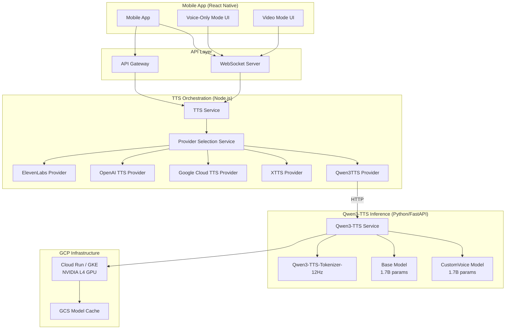
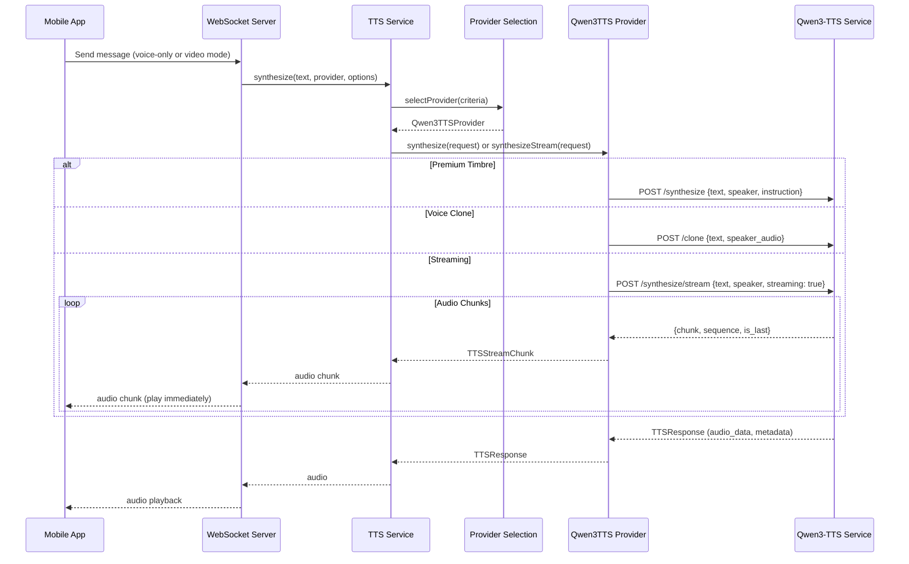
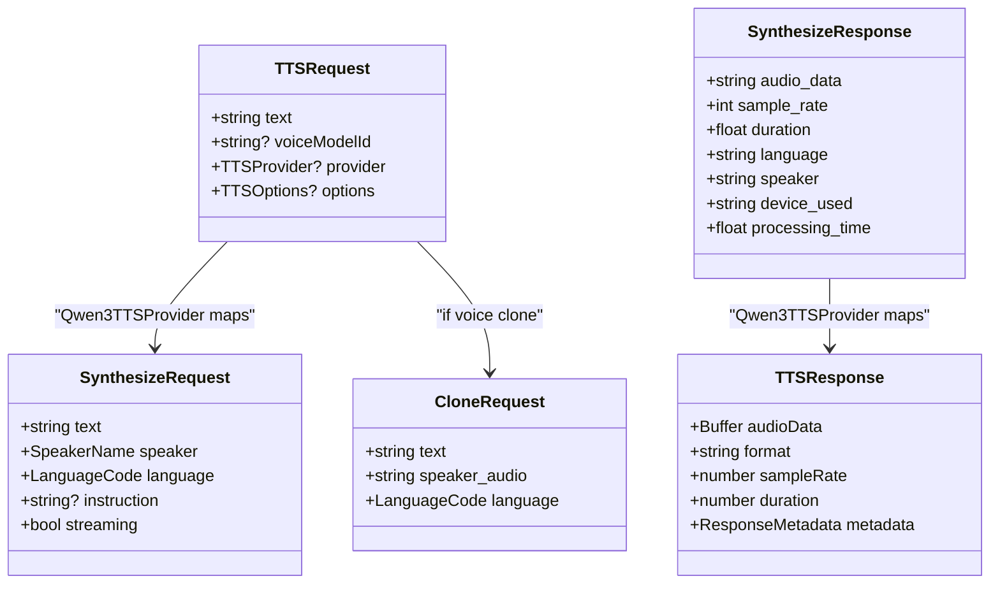

# Design Document: Qwen3-TTS Voice Cloning Integration

## Overview

This design integrates the Qwen3-TTS-12Hz-1.7B-CustomVoice and Base models into the existing conversational AI monorepo. The integration follows the established service pattern: a standalone Python/FastAPI service (`qwen3-tts-service`) handles model inference, while a TypeScript provider (`Qwen3TTSProvider`) in the existing `tts-service` bridges the orchestration layer. A voice-only conversation mode is added to the mobile app for users without face cloning.

The architecture mirrors the existing `xtts-service` → `XTTSProvider` pattern, keeping the Python ML inference isolated from the TypeScript orchestration layer. The Qwen3-TTS service loads two models: the CustomVoice model for premium timbres with instruction-based style control, and the Base model for 3-second rapid voice cloning.

## Architecture



### Request Flow



## GPU Requirements and Latency Analysis

### Model Memory Footprint

The Qwen3-TTS-12Hz-1.7B model uses a 12Hz audio codec, meaning it generates 12 audio tokens per second of speech. This is significantly more efficient than typical 50-75Hz codecs, reducing both compute and memory requirements.

| Configuration                            | VRAM Required | Notes                                                |
| ---------------------------------------- | ------------- | ---------------------------------------------------- |
| Single model (FP16)                      | ~3.4 GB       | 1.7B params × 2 bytes                                |
| Single model (FP16) + KV cache + runtime | ~6-8 GB       | Includes inference overhead                          |
| Both models loaded (FP16)                | ~12-16 GB     | CustomVoice + Base + tokenizer + runtime             |
| Both models + vLLM serving (FP16)        | ~16-20 GB     | Additional overhead for vLLM engine, paged attention |

### GPU Tier Comparison

| GPU              | VRAM  | Architecture | Est. First-Token Latency | Est. RTF (Real-Time Factor) | Concurrent Requests | Recommended For              |
| ---------------- | ----- | ------------ | ------------------------ | --------------------------- | ------------------- | ---------------------------- |
| NVIDIA T4        | 16 GB | Turing       | 300-500ms                | ~0.3-0.5x                   | 1-2                 | Dev/testing only             |
| NVIDIA L4        | 24 GB | Ada Lovelace | 100-250ms                | ~0.1-0.2x                   | 3-5                 | **Production (recommended)** |
| NVIDIA A100 40GB | 40 GB | Ampere       | 50-100ms                 | ~0.05-0.1x                  | 8-15                | High-throughput production   |
| NVIDIA L40S      | 48 GB | Ada Lovelace | 60-120ms                 | ~0.06-0.12x                 | 8-12                | High-throughput alternative  |

**Notes:**

- The Qwen team reports end-to-end latency as low as 97ms with dual-track hybrid streaming (likely on A100/H100 class hardware)
- RTF < 1.0 means audio is generated faster than real-time (0.1x = 10× faster than real-time)
- FlashAttention 2 is supported on Ada Lovelace (L4, L40S) and Ampere (A100) architectures, reducing memory usage by ~40%
- T4 (Turing) does NOT support FlashAttention 2 — falls back to standard attention with higher memory usage
- vLLM deployment adds ~2-4 GB overhead but enables continuous batching for better throughput under load

### Deployment Recommendation

**Primary: NVIDIA L4 on GCP Cloud Run GPU**

- 24 GB VRAM comfortably fits both models with vLLM
- Ada Lovelace architecture supports FlashAttention 2
- GCP Cloud Run GPU pricing: ~$0.70/hr (L4), scales to zero when idle
- First-token latency of 100-250ms is acceptable for real-time conversation (within the 500ms streaming requirement)

**Scaling: NVIDIA A100 on GKE**

- For high-traffic production with many concurrent users
- GKE GPU node pool with autoscaling (min 1, max N based on load)
- A100 40GB pricing: ~$2.50/hr on GCP
- Needed when concurrent request count exceeds 5 per instance

**Development: NVIDIA T4 or CPU**

- T4 for GPU testing on a budget (~$0.35/hr on GCP)
- CPU mode for local development (slow but functional)
- Docker Compose with optional GPU passthrough

### Deployment Configuration Constants

```python
# GPU deployment constants for Terraform/Docker
GPU_CONFIGS = {
    "dev": {
        "gpu_type": "nvidia-tesla-t4",
        "gpu_count": 1,
        "machine_type": "n1-standard-4",     # 4 vCPU, 15 GB RAM
        "memory_limit_gb": 16,
        "min_instances": 0,
        "max_instances": 1,
        "flash_attention": False,             # T4 doesn't support FA2
    },
    "production": {
        "gpu_type": "nvidia-l4",
        "gpu_count": 1,
        "machine_type": "g2-standard-8",      # 8 vCPU, 32 GB RAM
        "memory_limit_gb": 32,
        "min_instances": 1,
        "max_instances": 5,
        "flash_attention": True,              # L4 supports FA2
    },
    "high_throughput": {
        "gpu_type": "nvidia-tesla-a100",
        "gpu_count": 1,
        "machine_type": "a2-highgpu-1g",      # 12 vCPU, 85 GB RAM
        "memory_limit_gb": 85,
        "min_instances": 1,
        "max_instances": 10,
        "flash_attention": True,              # A100 supports FA2
    },
}
```

## Components and Interfaces

### 1. Qwen3-TTS Service (Python/FastAPI)

Located at `services/qwen3-tts-service/`, this is a standalone Python service following the same pattern as `services/xtts-service/`.

**File Structure:**

```
services/qwen3-tts-service/
├── main.py                  # FastAPI app, routes, startup
├── models.py                # Pydantic request/response models
├── service.py               # Qwen3TTSService class (model loading, inference)
├── config.py                # Configuration from environment variables
├── requirements.txt         # Base Python dependencies
├── requirements.gpu.txt     # GPU-specific dependencies (CUDA, FlashAttention2)
├── Dockerfile               # NVIDIA CUDA-based Docker image
├── Dockerfile.cpu           # CPU-only Docker image for local dev
├── docker-compose.yml       # Local development compose
├── test_qwen3_tts.py        # pytest tests
└── README.md
```

**API Endpoints:**

| Endpoint             | Method | Description                                              |
| -------------------- | ------ | -------------------------------------------------------- |
| `/health`            | GET    | Service health, device, model state, GPU info            |
| `/ready`             | GET    | Returns 200 only when models are loaded                  |
| `/synthesize`        | POST   | Premium timbre synthesis with optional style instruction |
| `/clone`             | POST   | Voice cloning from audio sample                          |
| `/synthesize/stream` | POST   | Streaming synthesis (chunked response)                   |
| `/languages`         | GET    | Supported language codes and names                       |
| `/speakers`          | GET    | Available premium timbre names                           |

**Pydantic Models (models.py):**

```python
from pydantic import BaseModel, Field
from typing import Optional
from enum import Enum

class SpeakerName(str, Enum):
    VIVIAN = "Vivian"
    SERENA = "Serena"
    UNCLE_FU = "Uncle_Fu"
    DYLAN = "Dylan"
    ERIC = "Eric"
    RYAN = "Ryan"
    AIDEN = "Aiden"
    ONO_ANNA = "Ono_Anna"
    SOHEE = "Sohee"

class LanguageCode(str, Enum):
    ZH = "zh"
    EN = "en"
    JA = "ja"
    KO = "ko"
    DE = "de"
    FR = "fr"
    RU = "ru"
    PT = "pt"
    ES = "es"
    IT = "it"

class SynthesizeRequest(BaseModel):
    text: str = Field(..., min_length=1, max_length=2000)
    speaker: SpeakerName = Field(default=SpeakerName.VIVIAN)
    language: LanguageCode = Field(default=LanguageCode.EN)
    instruction: Optional[str] = Field(None, max_length=500)
    streaming: bool = Field(default=False)

class CloneRequest(BaseModel):
    text: str = Field(..., min_length=1, max_length=2000)
    speaker_audio: str = Field(..., description="Base64-encoded audio (WAV/MP3/FLAC)")
    language: LanguageCode = Field(default=LanguageCode.EN)

class SynthesizeResponse(BaseModel):
    audio_data: str  # base64-encoded WAV
    sample_rate: int
    duration: float
    language: str
    speaker: str
    device_used: str
    processing_time: float

class StreamChunk(BaseModel):
    chunk: str  # base64-encoded audio segment
    sequence_number: int
    is_last: bool
    error: Optional[str] = None

class HealthResponse(BaseModel):
    status: str
    device: str
    platform: str
    custom_voice_model_loaded: bool
    base_model_loaded: bool
    gpu_available: bool
    gpu_memory_used_mb: Optional[float] = None
    gpu_memory_total_mb: Optional[float] = None
```

**Service Class (service.py) — Key Methods:**

```python
class Qwen3TTSService:
    async def initialize_models(self) -> None:
        """Load CustomVoice and Base models, download if not cached."""

    async def synthesize(self, request: SynthesizeRequest) -> SynthesizeResponse:
        """Generate audio using CustomVoice model with premium timbre."""

    async def clone_voice(self, request: CloneRequest) -> SynthesizeResponse:
        """Generate audio using Base model with voice cloning from audio sample."""

    async def synthesize_stream(self, request: SynthesizeRequest) -> AsyncGenerator[StreamChunk, None]:
        """Stream audio chunks using CustomVoice model."""

    def validate_audio_sample(self, audio_b64: str) -> tuple[str, float]:
        """Decode, validate format (WAV/MP3/FLAC), check >= 3s duration. Returns (path, duration)."""

    def get_gpu_info(self) -> dict:
        """Return GPU memory usage and availability."""
```

### 2. Qwen3TTS Provider (TypeScript)

Located at `services/tts-service/src/providers/Qwen3TTSProvider.ts`, extends `BaseProvider` and implements `ITTSProvider`.

```typescript
interface Qwen3TTSConfig {
  serviceUrl?: string;
  gpuEnabled?: boolean;
  maxConsecutiveFailures?: number;
  cooldownPeriodMs?: number;
}

interface Qwen3TTSSynthesizeResponse {
  audio_data: string;
  sample_rate: number;
  duration: number;
  language: string;
  speaker: string;
  device_used: string;
  processing_time: number;
}

interface Qwen3TTSStreamChunk {
  chunk: string;
  sequence_number: number;
  is_last: boolean;
  error?: string;
}

class Qwen3TTSProvider extends BaseProvider {
  // Circuit breaker state
  private consecutiveFailures: number;
  private isInCooldown: boolean;
  private cooldownTimer: NodeJS.Timeout | null;

  constructor(logger?: winston.Logger, config?: Qwen3TTSConfig);
  get isAvailable(): boolean;
  async initialize(config: Record<string, unknown>): Promise<void>;
  async synthesize(request: TTSRequest): Promise<TTSResponse>;
  async *synthesizeStream(request: TTSRequest): AsyncGenerator<TTSStreamChunk, void, unknown>;
  async getAvailableVoices(): Promise<string[]>;
  async estimateCost(text: string, options?: TTSOptions): Promise<number>;
  async healthCheck(): Promise<boolean>;

  // Private
  private isPremiumTimbre(voiceModelId: string): boolean;
  private buildSynthesizePayload(request: TTSRequest): object;
  private buildClonePayload(request: TTSRequest): object;
  private recordFailure(): void;
  private recordSuccess(): void;
  private enterCooldown(): void;
}
```

### 3. Shared Types Update

Add `QWEN3_TTS` to the `TTSProvider` enum in `packages/shared-types/src/ai-providers.ts`:

```typescript
export enum TTSProvider {
  XTTS_V2 = 'xtts-v2',
  GOOGLE_CLOUD_TTS = 'google-cloud-tts',
  OPENAI_TTS = 'openai-tts',
  ELEVENLABS = 'elevenlabs',
  QWEN3_TTS = 'qwen3-tts', // NEW
}
```

### 4. Voice-Only Mode (Mobile App)

New screen and navigation updates in the React Native mobile app.

**New Files:**

- `apps/mobile-app/src/screens/conversation/VoiceOnlyConversationScreen.tsx` — Audio-only conversation UI with waveform visualization
- `apps/mobile-app/src/components/audio/AudioWaveform.tsx` — Animated waveform component for AI speaking indicator

**Modified Files:**

- `apps/mobile-app/src/navigation/` — Add voice-only conversation route
- Conversation start flow — Check for active face model, offer voice-only if none

### 5. Docker & Infrastructure

**Dockerfile (GPU — Production):**
Based on `nvidia/cuda:12.1-devel-ubuntu22.04` with Python 3.12, `qwen-tts` package, FlashAttention 2, and `vllm` for production. Targets NVIDIA L4 (24 GB) as the primary production GPU per the GPU analysis above.

**Dockerfile.cpu (Local Dev):**
Based on `python:3.12-slim` without CUDA for local development and CI. Inference is slow but functional.

**docker-compose.yml:**
Local development compose with optional GPU passthrough (`deploy.resources.reservations.devices`), model cache volume mount at `/app/models`, and environment variable configuration.

**Terraform (infrastructure/terraform/modules/qwen3-tts/):**

| Resource                        | Configuration                                                  | Notes                                                    |
| ------------------------------- | -------------------------------------------------------------- | -------------------------------------------------------- |
| Cloud Run Service (production)  | `g2-standard-8`, NVIDIA L4, 32 GB RAM, min 1 / max 5 instances | Per GPU analysis: L4 gives 100-250ms first-token latency |
| Cloud Run Service (dev/staging) | `n1-standard-4`, NVIDIA T4, 16 GB RAM, min 0 / max 1           | Scales to zero, T4 for budget testing                    |
| GCS Bucket                      | Model weight cache bucket                                      | Avoids re-downloading ~3.4 GB model on each cold start   |
| Startup Script                  | `gsutil rsync` from GCS to `/app/models` before `uvicorn`      | Reduces cold start from minutes to seconds               |
| IAM                             | Service account with `storage.objectViewer` on model bucket    | Least privilege                                          |
| Environment Variables           | All config from `GPU_CONFIGS` dict above                       | Injected via Terraform `env` blocks                      |
| Health Check                    | HTTP `/ready` with 120s initial delay, 30s interval            | Model loading takes 30-90s depending on cache            |

**vLLM Production Mode:**
For high-throughput deployments (A100/L40S), the service can optionally use vLLM as the serving backend instead of direct `Qwen3TTSModel` inference. This enables continuous batching and paged attention for better throughput under concurrent load. Controlled by `USE_VLLM=true` environment variable.

## Data Models

### Request/Response Flow



### Voice Model ID Convention

The `voiceModelId` field in `TTSRequest` is used to distinguish between premium timbres and user voice clones:

| Pattern                | Example                       | Behavior                                                     |
| ---------------------- | ----------------------------- | ------------------------------------------------------------ |
| `qwen3-{timbre}`       | `qwen3-vivian`, `qwen3-dylan` | Routes to `/synthesize` with the premium timbre              |
| `qwen3-clone-{userId}` | `qwen3-clone-abc123`          | Routes to `/clone` with stored user audio sample             |
| `qwen3-{lang}`         | `qwen3-en`, `qwen3-ja`        | Routes to `/synthesize` with default timbre in that language |

### Configuration

**Qwen3-TTS Service Environment Variables:**

| Variable               | Default                                | Description                                      |
| ---------------------- | -------------------------------------- | ------------------------------------------------ |
| `PORT`                 | `8001`                                 | Service port                                     |
| `HOST`                 | `0.0.0.0`                              | Bind address                                     |
| `MODEL_CACHE_DIR`      | `/app/models`                          | Local model cache directory                      |
| `CUSTOM_VOICE_MODEL`   | `Qwen/Qwen3-TTS-12Hz-1.7B-CustomVoice` | HuggingFace model ID                             |
| `BASE_MODEL`           | `Qwen/Qwen3-TTS-12Hz-1.7B-Base`        | HuggingFace model ID for voice cloning           |
| `TOKENIZER_MODEL`      | `Qwen/Qwen3-TTS-Tokenizer-12Hz`        | HuggingFace tokenizer ID                         |
| `CUDA_VISIBLE_DEVICES` | `0`                                    | GPU device index                                 |
| `MAX_TEXT_LENGTH`      | `2000`                                 | Maximum input text length                        |
| `GCS_MODEL_BUCKET`     | ``                                     | GCS bucket for model weight caching (production) |

**Qwen3TTS Provider Environment Variables (TypeScript):**

| Variable                             | Default                 | Description                         |
| ------------------------------------ | ----------------------- | ----------------------------------- |
| `QWEN3_TTS_SERVICE_URL`              | `http://localhost:8001` | Qwen3-TTS service URL               |
| `QWEN3_TTS_GPU_ENABLED`              | `true`                  | Whether GPU is available            |
| `QWEN3_TTS_MAX_CONSECUTIVE_FAILURES` | `3`                     | Circuit breaker threshold           |
| `QWEN3_TTS_COOLDOWN_PERIOD_MS`       | `30000`                 | Cooldown period after circuit break |

## Correctness Properties

_A property is a characteristic or behavior that should hold true across all valid executions of a system — essentially, a formal statement about what the system should do. Properties serve as the bridge between human-readable specifications and machine-verifiable correctness guarantees._

### Property 1: Invalid input rejection

_For any_ request payload that violates the Pydantic schema constraints (missing required fields, wrong types, out-of-range values), the Qwen3-TTS service SHALL return HTTP 422 with a non-empty error message.

**Validates: Requirements 1.5**

### Property 2: Invalid timbre rejection

_For any_ string that is not one of the 9 valid `SpeakerName` enum values, a synthesis request using that string as the speaker SHALL be rejected with HTTP 400/422 and the error response SHALL list the valid timbre names.

**Validates: Requirements 2.5**

### Property 3: Invalid language rejection

_For any_ string that is not one of the 10 valid `LanguageCode` enum values, a synthesis request using that string as the language SHALL be rejected with HTTP 400/422 and the error response SHALL list the supported language codes.

**Validates: Requirements 5.3**

### Property 4: Synthesis response completeness

_For any_ valid synthesis or clone request, the response SHALL contain non-empty `audio_data` (valid base64), a positive `sample_rate`, a positive `duration`, and a non-negative `processing_time`.

**Validates: Requirements 2.4, 3.4**

### Property 5: Premium timbre synthesis succeeds for all timbres

_For any_ valid text and _for any_ of the 9 `SpeakerName` values, a synthesis request SHALL return a successful response with valid audio data.

**Validates: Requirements 2.1**

### Property 6: Short audio sample rejection

_For any_ audio sample with duration less than 3 seconds, a voice clone request SHALL be rejected with HTTP 400 and an error message indicating the minimum duration requirement.

**Validates: Requirements 3.2**

### Property 7: Valid clone request produces audio

_For any_ valid audio sample of at least 3 seconds and _for any_ valid text, a voice clone request SHALL return a successful response with valid audio data.

**Validates: Requirements 3.1**

### Property 8: Streaming chunk structure

_For any_ valid streaming synthesis request, the response SHALL consist of one or more chunks where each chunk contains valid base64 `chunk` data, a non-negative `sequence_number`, and a boolean `is_last` flag. The sequence numbers SHALL be monotonically increasing, and exactly one chunk SHALL have `is_last=true` as the final chunk.

**Validates: Requirements 4.1, 4.2**

### Property 9: Voice model ID routing

_For any_ `voiceModelId` matching the pattern `qwen3-{timbre}` where `{timbre}` is a valid `SpeakerName`, the Qwen3TTSProvider SHALL route the request to the `/synthesize` endpoint. _For any_ `voiceModelId` matching the pattern `qwen3-clone-{userId}`, the provider SHALL route the request to the `/clone` endpoint.

**Validates: Requirements 6.3, 6.4**

### Property 10: Conversation mode selection based on face model

_For any_ user without an active face model, the conversation start flow SHALL default to Voice_Only_Mode. _For any_ user with an active face model, the conversation start flow SHALL present both video mode and Voice_Only_Mode as options.

**Validates: Requirements 8.1, 8.4**

### Property 11: Circuit breaker activation

_For any_ sequence of N consecutive synthesis failures where N >= the configured `maxConsecutiveFailures` threshold, the Qwen3TTSProvider SHALL mark itself as unavailable. After the configured `cooldownPeriodMs` elapses, the provider SHALL attempt re-initialization.

**Validates: Requirements 9.4**

### Property 12: Failed request error propagation

_For any_ synthesis request that results in an error from the Qwen3-TTS service, the Qwen3TTSProvider SHALL return an error containing a descriptive message that includes the original error context.

**Validates: Requirements 9.2**

## Error Handling

### Qwen3-TTS Service (Python)

| Error Condition              | HTTP Status | Response                     | Recovery                      |
| ---------------------------- | ----------- | ---------------------------- | ----------------------------- |
| Invalid request payload      | 422         | Pydantic validation errors   | Client fixes input            |
| Unrecognized speaker name    | 422         | Valid speaker names listed   | Client uses valid name        |
| Unsupported language code    | 422         | Supported languages listed   | Client uses valid code        |
| Audio sample too short (<3s) | 400         | Minimum duration message     | Client provides longer sample |
| Invalid audio format         | 400         | Supported formats listed     | Client provides valid format  |
| GPU out of memory            | 503         | Retry-After header           | Client retries after delay    |
| Model not loaded yet         | 503         | "Model initializing" message | Client retries                |
| Internal inference error     | 500         | Error description            | Logged, client retries        |

### Qwen3TTS Provider (TypeScript)

| Error Condition               | Behavior                                        | Recovery                                 |
| ----------------------------- | ----------------------------------------------- | ---------------------------------------- |
| Service unreachable           | `isAvailable = false`, log error                | TTS Service falls back to next provider  |
| Synthesis request fails       | Log error with context, throw descriptive error | TTS Service can retry or fall back       |
| 3 consecutive failures        | Enter cooldown, `isAvailable = false`           | Auto re-initialize after cooldown period |
| Streaming connection drops    | Yield error chunk, close generator              | Client handles partial audio             |
| Invalid response from service | Log and throw parse error                       | TTS Service falls back                   |

### Mobile App (Voice-Only Mode)

| Error Condition                                 | Behavior                                     |
| ----------------------------------------------- | -------------------------------------------- |
| TTS audio stream fails                          | Display error toast, offer retry             |
| WebSocket disconnects during voice conversation | Attempt reconnect, show connection indicator |
| No TTS providers available                      | Display "service unavailable" message        |

## Testing Strategy

### Python Service (pytest)

**Unit Tests:**

- Pydantic model validation (valid and invalid payloads)
- Audio sample validation (format detection, duration check)
- Configuration loading from environment variables
- Health/ready endpoint responses in different model states

**Property-Based Tests (using `hypothesis`):**

- Property 1: Invalid input rejection — generate random invalid payloads
- Property 2: Invalid timbre rejection — generate random non-timbre strings
- Property 3: Invalid language rejection — generate random non-language strings
- Property 4: Synthesis response completeness — validate response structure
- Property 5: Premium timbre synthesis — test all timbres with random text
- Property 6: Short audio rejection — generate random short audio samples
- Property 7: Valid clone request — generate valid audio + random text
- Property 8: Streaming chunk structure — validate chunk sequence invariants

Each property test runs minimum 100 iterations. Each test is tagged with:
`Feature: qwen3-tts-voice-cloning, Property {N}: {property_text}`

### TypeScript Provider (Jest + fast-check)

**Unit Tests:**

- Provider initialization with mock HTTP responses
- Health check behavior with service up/down
- Cost estimation calculation
- Available voices list

**Property-Based Tests (using `fast-check`):**

- Property 9: Voice model ID routing — generate random voiceModelIds and verify routing
- Property 11: Circuit breaker activation — generate random failure sequences
- Property 12: Failed request error propagation — generate random error responses

Each property test runs minimum 100 iterations. Each test is tagged with:
`Feature: qwen3-tts-voice-cloning, Property {N}: {property_text}`

### Mobile App (Jest + React Native Testing Library)

**Unit Tests:**

- Voice-only mode renders correctly
- Audio waveform component visibility during AI speech
- Conversation mode selection based on user face model state

**Property-Based Tests (using `fast-check`):**

- Property 10: Conversation mode selection — generate random user states and verify mode options

### Integration Tests

- End-to-end: TTS Service → Qwen3TTSProvider → Qwen3-TTS Service (with real model, GPU required)
- Fallback: Qwen3-TTS unavailable → TTS Service selects alternative provider
- Streaming: Full streaming pipeline from provider through WebSocket to client
