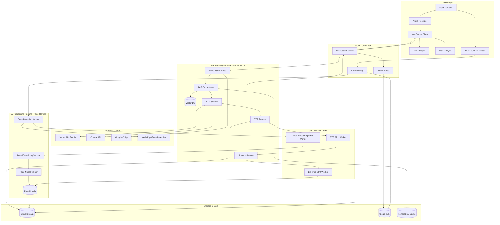
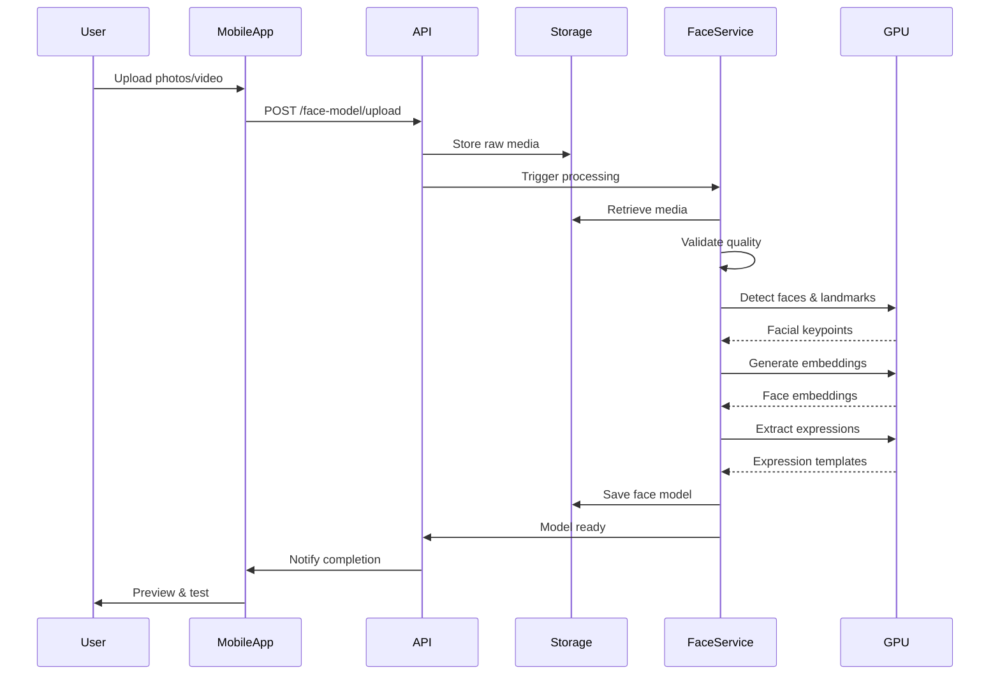
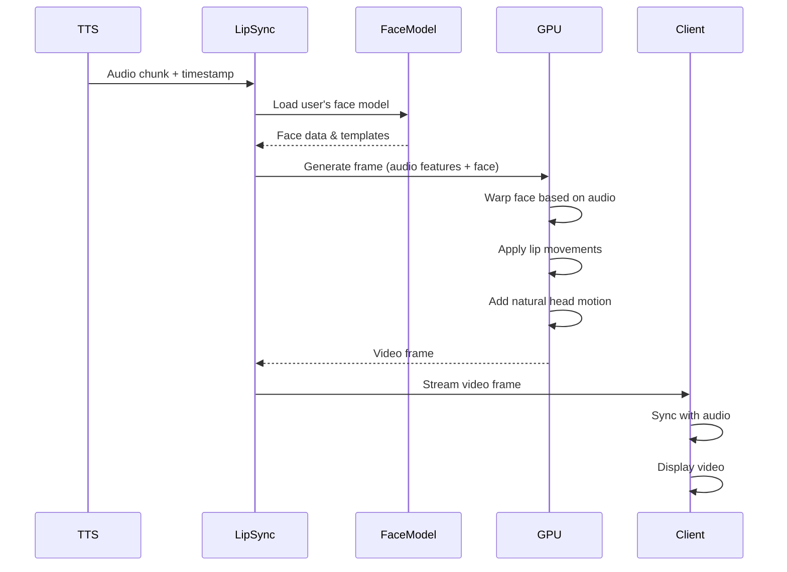

# Design Document

## Overview

The Real-Time Conversational Clone System is a distributed, cloud-native application that enables natural voice conversations between users and their AI-powered digital twins. The system leverages Google Cloud Platform services, OpenAI APIs, and open-source models to deliver sub-2-second latency voice interactions with personalized knowledge retrieval, voice cloning, and synchronized lip-sync video.

### Design Goals

1. **Ultra-low latency**: Achieve end-to-end response time under 2 seconds
2. **High fidelity**: Deliver 85%+ voice similarity and natural conversation flow
3. **Scalability**: Support 100+ concurrent conversations with auto-scaling
4. **Flexibility**: Support multiple AI providers (Google, OpenAI, open-source)
5. **Cost efficiency**: Target under $0.15 per 10-minute conversation
6. **Reliability**: Handle network interruptions and service failures gracefully

### Technology Stack

**Frontend:**

- React Native (iOS/Android)
- WebSocket client (Socket.io)
- React Native Audio Recorder
- React Native Video Player

**Backend (GCP):**

- Cloud Run (WebSocket server, API gateway)
- Cloud Functions (document processing, async tasks)
- Vertex AI (Gemini models)
- Speech-to-Text API (Chirp model)
- Cloud Storage (voice models, user data)
- Cloud SQL (metadata, user profiles)

**AI Services:**

- Google Chirp (ASR)
- Gemini 2.5 Flash / GPT-4 Turbo (LLM)
- XTTS-v2 / Google Cloud TTS / OpenAI TTS (voice synthesis)
- PostgreSQL with pgvector extension (vector database)

**Infrastructure:**

- GKE Autopilot (GPU workloads for TTS and lip-sync)
- Cloud Load Balancing
- Cloud Armor (DDoS protection)
- Cloud Monitoring & Logging

## Architecture

### High-Level Architecture Diagram



### Request Flow

**Face Model Creation Flow:**

1. **Media Upload** (Mobile App)
   - User captures photos or video via camera
   - App validates minimum requirements (3+ photos or 30s video)
   - Media uploaded to Cloud Storage via API Gateway
   - Upload progress shown to user

2. **Face Detection** (Face Detection Service)
   - Retrieves media from Cloud Storage
   - Detects faces in each frame using MediaPipe
   - Extracts 468 facial landmarks per frame
   - Validates face quality (lighting, angle, clarity)
   - Filters low-quality frames

3. **Face Embedding Generation** (Face Embedding Service)
   - Generates face embeddings using FaceNet/ArcFace
   - Creates average embedding for identity
   - Stores multiple embeddings for robustness
   - Validates embedding quality

4. **Expression Template Extraction** (Face Model Trainer)
   - Identifies neutral expression frame
   - Extracts talking expressions (if video)
   - Creates blendshape templates
   - Generates expression keypoint configurations

5. **Model Finalization** (Face Model Trainer)
   - Compiles face model with all components
   - Stores model artifacts in Cloud Storage
   - Updates user profile with model reference
   - Notifies mobile app of completion

6. **Preview & Validation** (Mobile App)
   - User tests face model with sample audio
   - Reviews generated video quality
   - Can re-upload if unsatisfied
   - Activates model for conversations

**Conversation Turn Flow:**

1. **Audio Capture** (Mobile App)
   - User speaks → microphone captures audio
   - Audio buffered in 100ms chunks
   - VAD detects speech activity

2. **Audio Streaming** (Mobile → Backend)
   - WebSocket sends audio chunks with metadata
   - Chunks tagged with session ID and sequence number
   - Continuous streaming until VAD detects silence

3. **Speech Recognition** (ASR Service)
   - Receives audio stream
   - Chirp processes in real-time
   - Emits interim and final transcripts
   - Sends final transcript to RAG Pipeline

4. **Knowledge Retrieval** (RAG Pipeline)
   - Generates query embedding
   - Searches vector database
   - Retrieves top 3-5 relevant chunks
   - Assembles context with conversation history

5. **Response Generation** (LLM Service)
   - Constructs prompt with context
   - Streams tokens from LLM
   - Buffers into sentences for TTS

6. **Voice Synthesis** (TTS Service)
   - Receives sentence chunks
   - Loads user's voice model from Cloud Storage
   - Generates audio with cloned voice
   - Streams audio chunks back

7. **Lip-sync Generation** (Lip-sync Service)
   - Receives audio chunks
   - Loads user's face model from Cloud Storage
   - Extracts audio features (mel-spectrogram, MFCC)
   - Generates synchronized video frames using TPSM/SadTalker
   - Applies facial expressions and head motion
   - Streams video frames

8. **Response Delivery** (Backend → Mobile)
   - Multiplexes audio and video streams
   - WebSocket delivers to client with timestamps
   - Client synchronizes audio and video playback
   - Client plays audio and displays video in real-time

## Components and Interfaces

### 1. Mobile App (React Native)

**Responsibilities:**

- Capture and stream user audio
- Display conversation UI and video
- Play synthesized audio responses
- Manage WebSocket connection
- Handle interruptions and state transitions

**Key Modules:**

**AudioManager**

```typescript
interface AudioManager {
  startRecording(): Promise<void>;
  stopRecording(): Promise<void>;
  streamAudioChunk(chunk: AudioBuffer): void;
  playAudioChunk(chunk: AudioBuffer): void;
  stopPlayback(): void;
}
```

**WebSocketClient**

```typescript
interface WebSocketClient {
  connect(token: string): Promise<void>;
  disconnect(): void;
  sendAudioChunk(data: AudioChunkMessage): void;
  onTranscript(callback: (transcript: TranscriptMessage) => void): void;
  onResponseAudio(callback: (audio: AudioChunkMessage) => void): void;
  onResponseVideo(callback: (video: VideoFrameMessage) => void): void;
  onError(callback: (error: ErrorMessage) => void): void;
}
```

**ConversationStateManager**

```typescript
enum ConversationState {
  IDLE = 'idle',
  LISTENING = 'listening',
  PROCESSING = 'processing',
  SPEAKING = 'speaking',
  INTERRUPTED = 'interrupted',
  ERROR = 'error',
}

interface ConversationStateManager {
  currentState: ConversationState;
  transitionTo(state: ConversationState): void;
  canTransition(from: ConversationState, to: ConversationState): boolean;
}
```

**VideoRenderer**

```typescript
interface VideoRenderer {
  renderFrame(frame: VideoFrame): void;
  syncWithAudio(audioTimestamp: number): void;
  clear(): void;
}
```

### 2. WebSocket Server (Cloud Run)

**Responsibilities:**

- Maintain persistent connections with mobile clients
- Route messages between clients and AI services
- Handle authentication and session management
- Implement connection pooling and load balancing

**Key Components:**

**ConnectionManager**

```typescript
interface ConnectionManager {
  handleConnection(socket: WebSocket, token: string): Promise<Session>;
  handleDisconnection(sessionId: string): void;
  sendToClient(sessionId: string, message: Message): void;
  broadcastToSession(sessionId: string, message: Message): void;
}
```

**SessionManager**

```typescript
interface Session {
  id: string;
  userId: string;
  connectionId: string;
  state: ConversationState;
  conversationHistory: ConversationTurn[];
  createdAt: Date;
  lastActivityAt: Date;
}

interface SessionManager {
  createSession(userId: string): Session;
  getSession(sessionId: string): Session | null;
  updateSession(sessionId: string, updates: Partial<Session>): void;
  endSession(sessionId: string): void;
}
```

**MessageRouter**

```typescript
interface MessageRouter {
  routeAudioChunk(sessionId: string, chunk: AudioChunkMessage): void;
  routeInterruption(sessionId: string): void;
  handleASRResult(sessionId: string, transcript: string): void;
  handleLLMToken(sessionId: string, token: string): void;
  handleTTSAudio(sessionId: string, audio: AudioBuffer): void;
  handleLipSyncFrame(sessionId: string, frame: VideoFrame): void;
}
```

### 3. ASR Service (Google Chirp)

**Responsibilities:**

- Convert streaming audio to text in real-time
- Provide interim and final transcripts
- Handle multiple languages with auto-detection
- Optimize for conversational speech

**Implementation:**

```typescript
interface ASRService {
  startStream(sessionId: string, config: ASRConfig): StreamHandle;
  sendAudioChunk(handle: StreamHandle, chunk: AudioBuffer): void;
  endStream(handle: StreamHandle): void;
  onInterimResult(callback: (result: InterimTranscript) => void): void;
  onFinalResult(callback: (result: FinalTranscript) => void): void;
}

interface ASRConfig {
  sampleRate: number;
  encoding: AudioEncoding;
  languageCode?: string;
  enableAutomaticPunctuation: boolean;
  enableWordTimeOffsets: boolean;
  model: 'chirp' | 'latest_long' | 'latest_short';
}

interface TranscriptResult {
  transcript: string;
  confidence: number;
  isFinal: boolean;
  words?: WordInfo[];
}
```

**Chirp Integration:**

- Use Chirp model for optimal streaming performance
- Enable automatic punctuation and capitalization
- Configure for conversational speech recognition
- Set interim results interval to 300ms

### 4. RAG Pipeline

**Responsibilities:**

- Embed user queries
- Search vector database for relevant knowledge
- Rank and filter results
- Assemble context for LLM

**Components:**

**EmbeddingService**

```typescript
interface EmbeddingService {
  embedQuery(text: string): Promise<number[]>;
  embedDocuments(documents: string[]): Promise<number[][]>;
}
```

**VectorSearchService**

```typescript
interface VectorSearchService {
  search(embedding: number[], topK: number, filter?: Filter): Promise<SearchResult[]>;
  upsert(vectors: Vector[]): Promise<void>;
  delete(ids: string[]): Promise<void>;
}

interface SearchResult {
  id: string;
  score: number;
  metadata: Record<string, any>;
  content: string;
}

interface Filter {
  userId: string;
  sourceType?: string;
  dateRange?: { start: Date; end: Date };
}
```

**ContextAssembler**

```typescript
interface ContextAssembler {
  assembleContext(
    query: string,
    searchResults: SearchResult[],
    conversationHistory: ConversationTurn[],
    userProfile: UserProfile
  ): LLMContext;
}

interface LLMContext {
  systemPrompt: string;
  userPersonality: string;
  relevantKnowledge: string[];
  conversationHistory: string;
  currentQuery: string;
}
```

**RAG Orchestrator**

```typescript
interface RAGOrchestrator {
  processQuery(sessionId: string, query: string): Promise<LLMContext>;

  updateKnowledgeBase(userId: string, documents: Document[]): Promise<void>;
}
```

**Vector Database Schema (PostgreSQL with pgvector):**

```sql
-- Enable pgvector extension
CREATE EXTENSION IF NOT EXISTS vector;

-- Create embeddings table with vector column
CREATE TABLE embeddings (
  id UUID PRIMARY KEY DEFAULT gen_random_uuid(),
  user_id UUID NOT NULL REFERENCES users(id),
  document_id UUID REFERENCES knowledge_documents(id),
  chunk_index INTEGER NOT NULL,
  source_type VARCHAR(50) NOT NULL CHECK (source_type IN ('document', 'faq', 'conversation')),
  content TEXT NOT NULL,
  embedding vector(768), -- Google text-embedding-004 produces 768-dimensional vectors
  metadata JSONB,
  created_at TIMESTAMP DEFAULT NOW(),
  updated_at TIMESTAMP DEFAULT NOW()
);

-- Create indexes for efficient vector search
CREATE INDEX idx_embeddings_user_id ON embeddings(user_id);
CREATE INDEX idx_embeddings_document_id ON embeddings(document_id);
CREATE INDEX idx_embeddings_source_type ON embeddings(source_type);
CREATE INDEX idx_embeddings_vector ON embeddings USING ivfflat (embedding vector_cosine_ops) WITH (lists = 100);

-- Create GIN index for metadata JSONB queries
CREATE INDEX idx_embeddings_metadata ON embeddings USING gin(metadata);
```

**TypeScript Interface:**

```typescript
interface EmbeddingRecord {
  id: string;
  userId: string;
  documentId: string;
  chunkIndex: number;
  sourceType: 'document' | 'faq' | 'conversation';
  content: string;
  embedding: number[];
  metadata: {
    title?: string;
    url?: string;
    timestamp?: number;
    [key: string]: any;
  };
  createdAt: Date;
  updatedAt: Date;
}
```

### 5. LLM Service

**Responsibilities:**

- Generate contextual responses using retrieved knowledge
- Stream tokens for low latency
- Support multiple LLM providers
- Implement fallback logic

**Implementation:**

```typescript
interface LLMService {
  generateResponse(context: LLMContext, config: LLMConfig): AsyncGenerator<string>;

  selectProvider(preferredProvider: LLMProvider, fallbackProviders: LLMProvider[]): LLMProvider;
}

interface LLMConfig {
  provider: LLMProvider;
  model: string;
  temperature: number;
  maxTokens: number;
  stopSequences?: string[];
  streamingEnabled: boolean;
}

enum LLMProvider {
  GEMINI_FLASH = 'gemini-flash',
  GEMINI_PRO = 'gemini-pro',
  GPT4_TURBO = 'gpt4-turbo',
  GPT4 = 'gpt4',
  GROQ_LLAMA = 'groq-llama',
}
```

**Provider Adapters:**

```typescript
interface GeminiAdapter {
  streamGenerate(prompt: string, config: GeminiConfig): AsyncGenerator<string>;
}

interface OpenAIAdapter {
  streamGenerate(messages: ChatMessage[], config: OpenAIConfig): AsyncGenerator<string>;
}

interface GroqAdapter {
  streamGenerate(prompt: string, config: GroqConfig): AsyncGenerator<string>;
}
```

**Prompt Template:**

```typescript
const CLONE_PROMPT_TEMPLATE = `You are {userName}'s AI clone with their personality and knowledge.

Personality Traits:
{personalityTraits}

Relevant Knowledge:
{relevantKnowledge}

Recent Conversation:
{conversationHistory}

Current Question: {currentQuery}

Instructions:
- Respond naturally as {userName} would
- Use the provided knowledge to answer accurately
- Keep responses concise (2-3 sentences for voice)
- If you don't have information, say so clearly
- Maintain {userName}'s tone and speaking style

Response:`;
```

### 6. TTS Service (Multi-Provider)

**Responsibilities:**

- Synthesize speech in user's cloned voice
- Stream audio chunks for low latency
- Support multiple TTS providers
- Manage voice model storage

**Implementation:**

```typescript
interface TTSService {
  synthesize(text: string, voiceConfig: VoiceConfig): AsyncGenerator<AudioBuffer>;

  trainVoiceModel(
    userId: string,
    audioSamples: AudioBuffer[],
    provider: TTSProvider
  ): Promise<VoiceModel>;

  getVoiceModel(userId: string): Promise<VoiceModel>;
}

interface VoiceConfig {
  provider: TTSProvider;
  voiceModelId: string;
  sampleRate: number;
  speed: number;
  pitch: number;
}

enum TTSProvider {
  XTTS_V2 = 'xtts-v2',
  GOOGLE_CLOUD_TTS = 'google-cloud-tts',
  OPENAI_TTS = 'openai-tts',
}

interface VoiceModel {
  id: string;
  userId: string;
  provider: TTSProvider;
  modelPath: string;
  sampleRate: number;
  createdAt: Date;
  qualityScore: number;
}
```

**Provider-Specific Implementations:**

**XTTS-v2 Service:**

```typescript
interface XTTSService {
  loadModel(voiceModelPath: string): Promise<void>;
  synthesizeStreaming(text: string, speakerEmbedding: number[]): AsyncGenerator<AudioBuffer>;
  trainSpeaker(audioSamples: AudioBuffer[]): Promise<number[]>;
}
```

**Google Cloud TTS Service:**

```typescript
interface GoogleTTSService {
  synthesizeWithCustomVoice(text: string, voiceName: string): AsyncGenerator<AudioBuffer>;
  createCustomVoice(userId: string, audioSamples: AudioBuffer[]): Promise<string>;
}
```

**OpenAI TTS Service:**

```typescript
interface OpenAITTSService {
  synthesize(
    text: string,
    voice: OpenAIVoice,
    model: 'tts-1' | 'tts-1-hd'
  ): AsyncGenerator<AudioBuffer>;
}

type OpenAIVoice = 'alloy' | 'echo' | 'fable' | 'onyx' | 'nova' | 'shimmer';
```

### 7. Lip-sync and Face Cloning Service

**Responsibilities:**

- Create personalized face models from user photos/videos
- Generate video frames synchronized with audio
- Maintain low latency for real-time streaming
- Preserve user's facial features and expressions
- Use lightweight models for GPU efficiency

**Implementation:**

```typescript
interface LipSyncService {
  generateFrames(audioChunk: AudioBuffer, faceModel: FaceModel): AsyncGenerator<VideoFrame>;

  loadFaceModel(userId: string): Promise<FaceModel>;

  createFaceModel(userId: string, referenceMedia: ReferenceMedia): Promise<FaceModel>;

  validateFaceQuality(media: ReferenceMedia): FaceQualityResult;
}

interface FaceModel {
  id: string;
  userId: string;
  modelPath: string;
  resolution: { width: number; height: number };
  keypoints: FacialKeypoint[];
  embeddings: FaceEmbedding[];
  neutralPose: ImageBuffer;
  expressionTemplates: ExpressionTemplate[];
  createdAt: Date;
  qualityScore: number;
}

interface ReferenceMedia {
  type: 'images' | 'video';
  data: ImageBuffer[] | VideoBuffer;
  duration?: number; // for video
  frameCount?: number; // for video
}

interface FaceQualityResult {
  isValid: boolean;
  faceDetected: boolean;
  resolution: { width: number; height: number };
  lighting: 'good' | 'poor' | 'acceptable';
  angle: 'frontal' | 'profile' | 'angled';
  clarity: number; // 0-1
  recommendations: string[];
}

interface VideoFrame {
  data: Buffer;
  timestamp: number;
  format: 'jpeg' | 'h264';
  width: number;
  height: number;
  audioTimestamp: number; // for sync
}

interface FacialKeypoint {
  x: number;
  y: number;
  confidence: number;
  landmark: string; // e.g., 'left_eye', 'mouth_corner'
}

interface ExpressionTemplate {
  name: string; // 'neutral', 'smile', 'talking'
  keypoints: FacialKeypoint[];
  blendshapes: number[];
}
```

**Face Model Creation Pipeline:**

1. **Media Upload and Validation**
   - User uploads 5-10 photos or 30-60 second video
   - Validate face detection in all frames
   - Check lighting, resolution, and clarity
   - Ensure frontal and slight angle views

2. **Face Detection and Alignment**
   - Detect face in each frame using MediaPipe or similar
   - Extract 468 facial landmarks
   - Align faces to canonical pose
   - Filter low-quality frames

3. **Face Embedding Generation**
   - Generate face embeddings using FaceNet or ArcFace
   - Create average embedding for identity
   - Store multiple embeddings for robustness

4. **Expression Template Extraction**
   - Identify neutral expression frame
   - Extract talking expressions (if video)
   - Create blendshape templates
   - Store keypoint configurations

5. **Model Training/Preparation**
   - Fine-tune lip-sync model on user's face (optional)
   - Create face texture maps
   - Generate 3D face mesh (optional for advanced mode)
   - Store model artifacts in Cloud Storage

**Real-time Video Generation:**

```typescript
interface VideoGenerator {
  // Initialize with pre-loaded face model
  initialize(faceModel: FaceModel): Promise<void>;

  // Generate frame from audio features
  generateFrame(audioFeatures: AudioFeatures, previousFrame?: VideoFrame): Promise<VideoFrame>;

  // Batch generation for efficiency
  generateFrameBatch(audioFeaturesBatch: AudioFeatures[]): Promise<VideoFrame[]>;
}

interface AudioFeatures {
  melSpectrogram: number[][];
  mfcc: number[];
  energy: number;
  pitch: number;
  timestamp: number;
}
```

**Model Options:**

1. **Wav2Lip (High Quality, Higher Latency)**
   - Best lip-sync accuracy
   - ~100ms per frame on T4 GPU
   - Use for high-quality mode or pre-recorded content
   - Requires face detection + lip-sync generation

2. **Thin-Plate Spline Motion (TPSM) - Recommended for Real-time**
   - Fast inference (~20ms per frame on T4 GPU)
   - Good quality for conversational video
   - Lower memory footprint
   - Warps source face based on audio

3. **SadTalker (Balanced)**
   - Generates head motion + lip-sync
   - ~50ms per frame on T4 GPU
   - More natural head movements
   - Good for longer conversations

4. **Audio2Head + Simple Lip-sync**
   - Generates head pose from audio
   - Combine with lightweight lip animation
   - ~30ms per frame
   - Good balance of quality and speed

5. **Fallback: Animated Overlay**
   - Static face image with animated mouth region
   - Minimal GPU usage (~5ms per frame)
   - Used when GPU resources constrained
   - Lower quality but always available

**Face Model Storage:**

```typescript
interface FaceModelStorage {
  // Store in Cloud Storage
  basePath: string; // gs://clone-face-models/{userId}/

  files: {
    neutralPose: string; // neutral_pose.jpg
    keypoints: string; // keypoints.json
    embeddings: string; // embeddings.npy
    textures: string; // textures/
    model: string; // model.pth (if fine-tuned)
    metadata: string; // metadata.json
  };
}
```

**Quality Validation:**

```typescript
interface FaceModelValidator {
  validateCreation(referenceMedia: ReferenceMedia, generatedModel: FaceModel): ValidationResult;

  testGeneration(model: FaceModel, testAudio: AudioBuffer): Promise<TestResult>;
}

interface ValidationResult {
  isValid: boolean;
  qualityScore: number; // 0-100
  issues: string[];
  recommendations: string[];
}

interface TestResult {
  videoSample: VideoBuffer;
  lipSyncScore: number; // 0-1
  faceQuality: number; // 0-1
  frameRate: number;
  averageLatency: number;
}
```

### 8. Document Processing Service

**Responsibilities:**

- Extract text from uploaded documents
- Chunk content for embedding
- Generate and store embeddings
- Handle various file formats

**Implementation:**

```typescript
interface DocumentProcessor {
  processDocument(userId: string, file: File): Promise<ProcessedDocument>;

  extractText(file: File): Promise<string>;

  chunkText(text: string, chunkSize: number, overlap: number): TextChunk[];

  embedAndStore(userId: string, chunks: TextChunk[]): Promise<void>;
}

interface ProcessedDocument {
  id: string;
  userId: string;
  filename: string;
  contentType: string;
  textContent: string;
  chunks: TextChunk[];
  processedAt: Date;
}

interface TextChunk {
  id: string;
  documentId: string;
  content: string;
  chunkIndex: number;
  startOffset: number;
  endOffset: number;
  metadata: Record<string, any>;
}
```

**Processing Pipeline:**

1. Upload to Cloud Storage
2. Trigger Cloud Function
3. Extract text (PDF.js, Mammoth, etc.)
4. Clean and normalize text
5. Chunk with overlap
6. Generate embeddings (batch)
7. Upsert to vector database
8. Update metadata in Cloud SQL

## Data Models

### User Profile

```typescript
interface UserProfile {
  id: string;
  email: string;
  name: string;
  createdAt: Date;
  updatedAt: Date;

  // Personality configuration
  personalityTraits: string[];
  speakingStyle: string;

  // Voice configuration
  voiceModels: VoiceModelReference[];
  activeVoiceModelId: string;

  // AI provider preferences
  preferredLLMProvider: LLMProvider;
  preferredTTSProvider: TTSProvider;

  // Usage and limits
  conversationMinutesUsed: number;
  subscriptionTier: 'free' | 'pro' | 'enterprise';

  // Settings
  settings: UserSettings;
}

interface UserSettings {
  enableConversationHistory: boolean;
  autoLanguageDetection: boolean;
  videoQuality: 'low' | 'medium' | 'high' | 'auto';
  interruptionSensitivity: number; // 0-1
}

interface VoiceModelReference {
  id: string;
  provider: TTSProvider;
  modelPath: string;
  qualityScore: number;
  createdAt: Date;
}
```

### Conversation Session

```typescript
interface ConversationSession {
  id: string;
  userId: string;
  startedAt: Date;
  endedAt?: Date;
  durationSeconds: number;

  // State
  state: ConversationState;
  currentTurnId?: string;

  // Configuration
  llmProvider: LLMProvider;
  ttsProvider: TTSProvider;
  voiceModelId: string;

  // Metrics
  totalTurns: number;
  averageLatencyMs: number;
  totalCost: number;

  // History
  turns: ConversationTurn[];
}

interface ConversationTurn {
  id: string;
  sessionId: string;
  timestamp: Date;

  // User input
  userAudioDurationMs: number;
  userTranscript: string;
  transcriptConfidence: number;

  // System response
  retrievedChunks: string[];
  llmResponse: string;
  responseAudioDurationMs: number;

  // Performance metrics
  asrLatencyMs: number;
  ragLatencyMs: number;
  llmLatencyMs: number;
  ttsLatencyMs: number;
  totalLatencyMs: number;

  // Costs
  asrCost: number;
  llmCost: number;
  ttsCost: number;
  totalCost: number;
}
```

### Knowledge Base Document

```typescript
interface KnowledgeDocument {
  id: string;
  userId: string;
  filename: string;
  contentType: string;
  sizeBytes: number;
  uploadedAt: Date;
  processedAt?: Date;

  // Content
  textContent: string;
  chunkCount: number;

  // Metadata
  title?: string;
  author?: string;
  sourceUrl?: string;
  tags: string[];

  // Processing status
  status: 'pending' | 'processing' | 'completed' | 'failed';
  errorMessage?: string;

  // Storage
  storagePath: string;
  vectorIds: string[];
}
```

### Message Protocol

```typescript
// Client -> Server Messages

interface AudioChunkMessage {
  type: 'audio_chunk';
  sessionId: string;
  sequenceNumber: number;
  audioData: string; // base64 encoded
  timestamp: number;
}

interface InterruptionMessage {
  type: 'interruption';
  sessionId: string;
  timestamp: number;
}

interface EndUtteranceMessage {
  type: 'end_utterance';
  sessionId: string;
  timestamp: number;
}

// Server -> Client Messages

interface TranscriptMessage {
  type: 'transcript';
  sessionId: string;
  transcript: string;
  isFinal: boolean;
  confidence: number;
}

interface ResponseStartMessage {
  type: 'response_start';
  sessionId: string;
  turnId: string;
}

interface ResponseAudioMessage {
  type: 'response_audio';
  sessionId: string;
  turnId: string;
  audioData: string; // base64 encoded
  sequenceNumber: number;
  timestamp: number;
}

interface ResponseVideoMessage {
  type: 'response_video';
  sessionId: string;
  turnId: string;
  frameData: string; // base64 encoded
  sequenceNumber: number;
  timestamp: number;
  format: 'jpeg' | 'h264';
}

interface ResponseEndMessage {
  type: 'response_end';
  sessionId: string;
  turnId: string;
  metrics: TurnMetrics;
}

interface ErrorMessage {
  type: 'error';
  sessionId: string;
  errorCode: string;
  errorMessage: string;
  recoverable: boolean;
}

interface TurnMetrics {
  totalLatencyMs: number;
  asrLatencyMs: number;
  ragLatencyMs: number;
  llmLatencyMs: number;
  ttsLatencyMs: number;
}
```

## Error Handling

### Error Categories

**1. Network Errors**

- WebSocket connection failures
- Timeout errors
- Packet loss

**Strategy:**

- Exponential backoff reconnection (1s, 2s, 4s, 8s, 16s, 30s max)
- Queue messages during disconnection
- Display connection status to user
- Automatic resume when reconnected

**2. ASR Errors**

- Audio quality too low
- Unsupported language
- Service unavailable

**Strategy:**

- Retry with different ASR configuration
- Prompt user to speak more clearly
- Fallback to text input if persistent
- Log audio quality metrics

**3. RAG Errors**

- Vector database unavailable
- No relevant knowledge found
- Embedding service failure

**Strategy:**

- Return cached responses for common queries
- Gracefully inform user of knowledge gap
- Continue conversation without context if needed
- Fallback to general knowledge mode

**4. LLM Errors**

- Rate limit exceeded
- Model unavailable
- Generation timeout

**Strategy:**

- Automatic fallback to alternative provider
- Queue request and retry
- Use cached response if available
- Inform user of delay

**5. TTS Errors**

- Voice model not found
- GPU resources unavailable
- Generation failure

**Strategy:**

- Fallback to default voice
- Queue on GPU wait list
- Use simpler TTS model
- Provide text response as fallback

**6. Lip-sync Errors**

- GPU unavailable
- Model loading failure
- Frame generation timeout

**Strategy:**

- Fallback to audio-only mode
- Use static image with audio
- Reduce video quality
- Continue conversation without video

### Error Recovery Flow

```typescript
interface ErrorHandler {
  handleError(error: Error, context: ErrorContext): Promise<ErrorResolution>;
  shouldRetry(error: Error, attemptCount: number): boolean;
  getFallbackStrategy(error: Error): FallbackStrategy;
}

interface ErrorContext {
  sessionId: string;
  component: string;
  operation: string;
  attemptCount: number;
  timestamp: Date;
}

interface ErrorResolution {
  action: 'retry' | 'fallback' | 'abort' | 'ignore';
  fallbackStrategy?: FallbackStrategy;
  userMessage?: string;
  retryDelayMs?: number;
}

enum FallbackStrategy {
  ALTERNATIVE_PROVIDER = 'alternative_provider',
  DEGRADED_MODE = 'degraded_mode',
  CACHED_RESPONSE = 'cached_response',
  TEXT_ONLY = 'text_only',
  AUDIO_ONLY = 'audio_only',
  QUEUE_AND_RETRY = 'queue_and_retry',
}
```

### Circuit Breaker Pattern

```typescript
interface CircuitBreaker {
  state: 'closed' | 'open' | 'half-open';
  failureCount: number;
  failureThreshold: number;
  resetTimeout: number;

  execute<T>(operation: () => Promise<T>): Promise<T>;
  recordSuccess(): void;
  recordFailure(): void;
  reset(): void;
}
```

Implement circuit breakers for:

- External API calls (Chirp, Gemini, OpenAI)
- Vector database queries
- GPU service calls
- Cloud Storage operations

## Testing Strategy

### Unit Testing

**Components to Test:**

- Audio processing utilities
- Message serialization/deserialization
- State machine transitions
- Embedding generation
- Text chunking algorithms
- Prompt template rendering
- Error handling logic

**Tools:**

- Jest (TypeScript/JavaScript)
- pytest (Python services)
- Mock external API calls
- Fixture data for audio/video

**Coverage Target:** 80%+ for core business logic

### Integration Testing

**Test Scenarios:**

1. **End-to-End Conversation Flow**
   - Send audio → receive transcript → get response → play audio/video
   - Verify latency targets met
   - Check data consistency across services

2. **WebSocket Communication**
   - Connection establishment and authentication
   - Message routing and ordering
   - Reconnection and recovery
   - Concurrent session handling

3. **RAG Pipeline**
   - Document upload and processing
   - Vector search accuracy
   - Context assembly
   - Knowledge retrieval performance

4. **Multi-Provider Integration**
   - Gemini API integration
   - OpenAI API integration
   - Chirp ASR integration
   - Provider fallback logic

5. **Voice Model Training**
   - Upload voice samples
   - Train XTTS-v2 model
   - Create Google Cloud TTS custom voice
   - Validate voice quality

**Tools:**

- Postman/Newman for API testing
- WebSocket test clients
- Synthetic audio/video data
- Load testing with k6

### Performance Testing

**Metrics to Measure:**

1. **Latency Breakdown**
   - ASR: < 300ms
   - RAG: < 200ms
   - LLM: < 1000ms (first token)
   - TTS: < 500ms (first chunk)
   - Lip-sync: < 300ms behind audio
   - End-to-end: < 2000ms

2. **Throughput**
   - Concurrent conversations supported
   - Messages per second per WebSocket
   - Vector searches per second
   - GPU frames per second

3. **Resource Utilization**
   - CPU usage per conversation
   - Memory usage per session
   - GPU utilization
   - Network bandwidth

**Load Testing Scenarios:**

- 10 concurrent conversations (baseline)
- 100 concurrent conversations (MVP target)
- 1000 concurrent conversations (production target)
- Spike test: 0 → 500 → 0 users in 5 minutes
- Soak test: 100 users for 2 hours

**Tools:**

- k6 for load testing
- Grafana for visualization
- Cloud Monitoring for GCP metrics
- Custom latency tracking

### Quality Testing

**Voice Quality:**

- Mean Opinion Score (MOS) testing
- Voice similarity measurement (cosine similarity of embeddings)
- A/B testing different TTS providers
- User feedback collection

**Conversation Quality:**

- Answer accuracy against knowledge base
- Response relevance scoring
- Conversation naturalness rating
- Interruption handling smoothness

**Video Quality:**

- Lip-sync accuracy measurement
- Frame rate consistency
- Audio-video synchronization offset
- Visual quality assessment

### Security Testing

**Test Cases:**

- Authentication bypass attempts
- Unauthorized access to other users' data
- SQL injection in metadata queries
- XSS in transcript display
- Rate limiting enforcement
- DDoS resilience
- Data encryption verification

**Tools:**

- OWASP ZAP
- Burp Suite
- Custom security scripts
- Penetration testing

### User Acceptance Testing

**Test Scenarios:**

1. First-time user onboarding
2. Voice model training and selection
3. Document upload and knowledge base creation
4. Natural conversation with interruptions
5. Network disconnection and recovery
6. Error handling and user feedback
7. Multi-device usage

**Success Criteria:**

- 90%+ task completion rate
- 4.5/5.0+ user satisfaction
- < 5% error rate
- < 10% support ticket rate

## Performance Optimization

### Latency Optimization

**1. ASR Optimization**

- Use Chirp model for lowest latency
- Enable streaming mode with interim results
- Optimize audio chunk size (100ms)
- Pre-warm ASR connections

**2. RAG Optimization**

- Cache embeddings for common queries
- Use approximate nearest neighbor search (HNSW)
- Limit vector search to top-k=5
- Pre-filter by user ID at database level
- Implement query result caching (PostgreSQL with indexed cache tables)

**3. LLM Optimization**

- Use streaming mode for token-by-token delivery
- Optimize prompt length (< 4K tokens)
- Use faster models (Gemini Flash, Groq)
- Implement response caching for FAQs
- Pre-warm model connections

**4. TTS Optimization**

- Stream audio generation sentence-by-sentence
- Pre-load voice models in memory
- Use GPU batching for multiple requests
- Implement audio chunk caching
- Optimize sample rate (22050 Hz sufficient)

**5. Lip-sync Optimization**

- Use lightweight model (TPSM)
- Reduce resolution (256x256 or 512x512)
- Generate at 15-20 FPS (not 30)
- Use keyframe interpolation
- Pre-load face models
- Batch frame generation

**6. Network Optimization**

- Use Opus codec for audio (efficient compression)
- Use H.264 for video streaming
- Implement adaptive bitrate
- Enable WebSocket compression
- Use CDN for static assets
- Optimize message serialization (Protocol Buffers)

### Caching Strategy

**Multi-Level Cache:**

```typescript
interface CacheStrategy {
  // L1: In-memory cache (Application Memory)
  l1Cache: {
    embeddings: Map<string, number[]>;
    commonResponses: Map<string, string>;
    voiceModels: Map<string, VoiceModel>;
  };

  // L2: Database cache (PostgreSQL with indexed cache tables)
  l2Cache: {
    vectorSearchResults: Map<string, SearchResult[]>;
    llmResponses: Map<string, string>;
    audioChunks: Map<string, AudioBuffer>;
  };

  // L3: Cloud Storage
  l3Cache: {
    processedDocuments: string;
    voiceModelFiles: string;
    conversationHistory: string;
  };
}
```

**Cache Invalidation:**

- Time-based expiration (TTL)
- Event-based invalidation (document update)
- LRU eviction for memory management
- Versioned cache keys

### Resource Pooling

**Connection Pools:**

- WebSocket connection pool (1000 connections per instance)
- Database connection pool (50 connections)
- HTTP client pool for API calls
- GPU worker pool (auto-scaling)

**Model Preloading:**

- Keep voice models in memory for active users
- Pre-warm LLM connections
- Cache face models for lip-sync
- Lazy load for inactive users

### Auto-Scaling Configuration

**Cloud Run (WebSocket Server):**

```yaml
minInstances: 2
maxInstances: 100
concurrency: 50
cpuThrottle: false
memory: 2Gi
cpu: 2
```

**GKE Autopilot (GPU Workloads):**

```yaml
TTS Service:
  minReplicas: 1
  maxReplicas: 20
  targetGPUUtilization: 70%
  gpuType: nvidia-tesla-t4

Lip-sync Service:
  minReplicas: 1
  maxReplicas: 15
  targetGPUUtilization: 80%
  gpuType: nvidia-tesla-t4
```

**Scaling Triggers:**

- Active conversation count
- GPU utilization
- Request queue depth
- Response latency (p95)

### Cost Optimization

**1. Compute Costs**

- Use preemptible/spot instances for GPU (60-70% savings)
- Auto-scale down during low usage
- Use Cloud Run for stateless services (pay per request)
- Optimize container images for faster cold starts

**2. AI Service Costs**

- Use Gemini Flash over Pro (10x cheaper)
- Implement response caching (reduce LLM calls)
- Use Groq for free tier when possible
- Batch embedding generation
- Optimize prompt length

**3. Storage Costs**

- Use lifecycle policies for old data
- Compress audio/video before storage
- Use Nearline/Coldline for archives
- Implement data retention policies

**4. Network Costs**

- Use Cloud CDN for static content
- Optimize payload sizes
- Enable compression
- Use regional resources when possible

**Cost Monitoring:**

```typescript
interface CostTracker {
  trackConversationCost(sessionId: string): {
    asrCost: number;
    llmCost: number;
    ttsCost: number;
    lipSyncCost: number;
    storageCost: number;
    networkCost: number;
    totalCost: number;
  };

  getAverageCostPerMinute(): number;
  getCostByProvider(): Map<string, number>;
  alertOnCostThreshold(threshold: number): void;
}
```

## Security and Privacy

### Authentication and Authorization

**Authentication Flow:**

1. User logs in via Mobile App (Firebase Auth or OAuth)
2. Backend issues JWT token with user claims
3. Mobile App includes JWT in WebSocket connection
4. WebSocket Server validates token on connection
5. Token refresh handled automatically

**JWT Claims:**

```typescript
interface JWTClaims {
  userId: string;
  email: string;
  subscriptionTier: string;
  permissions: string[];
  iat: number;
  exp: number;
}
```

**Authorization Rules:**

- Users can only access their own conversations
- Users can only query their own knowledge base
- Users can only manage their own voice models
- Admin users can access system metrics
- Rate limits enforced per user tier

### Data Encryption

**In Transit:**

- TLS 1.3 for all WebSocket connections
- HTTPS for all API calls
- Encrypted connections to databases
- VPC peering for internal services

**At Rest:**

- Cloud Storage encryption (AES-256)
- Cloud SQL encryption
- Encrypted vector database
- Encrypted voice model storage

**Key Management:**

- Google Cloud KMS for key management
- Automatic key rotation (90 days)
- Separate keys per data type
- Hardware security modules (HSM)

### Data Privacy

**User Data Handling:**

```typescript
interface DataRetentionPolicy {
  // Audio data
  userAudio: {
    stored: false; // Never stored by default
    retentionDays: 0;
    requiresConsent: true;
  };

  // Transcripts
  transcripts: {
    stored: true; // For conversation history
    retentionDays: 90;
    requiresConsent: true;
    deletable: true;
  };

  // Knowledge base
  knowledgeBase: {
    stored: true;
    retentionDays: null; // Indefinite until user deletes
    requiresConsent: false; // User uploaded
    deletable: true;
  };

  // Voice models
  voiceModels: {
    stored: true;
    retentionDays: null;
    requiresConsent: true;
    deletable: true;
  };

  // Conversation history
  conversationHistory: {
    stored: true;
    retentionDays: 90;
    requiresConsent: true;
    deletable: true;
  };
}
```

**User Rights:**

- Right to access all stored data
- Right to delete all data
- Right to export data (GDPR compliance)
- Right to opt-out of data collection
- Right to revoke consent

**Data Isolation:**

- User data isolated by userId
- No cross-user data access
- Separate vector namespaces per user
- Row-level security in databases

### Content Safety

**Input Filtering:**

```typescript
interface ContentFilter {
  checkUserInput(text: string): ContentSafetyResult;
  checkLLMOutput(text: string): ContentSafetyResult;
  blockInappropriateContent(text: string): boolean;
}

interface ContentSafetyResult {
  safe: boolean;
  categories: string[];
  confidence: number;
  action: 'allow' | 'block' | 'review';
}
```

**Safety Measures:**

- Perspective API for toxicity detection
- Custom keyword filtering
- LLM output validation
- User reporting mechanism
- Automated content review queue

### Rate Limiting

**Per-User Limits:**

```typescript
interface RateLimits {
  free: {
    conversationMinutesPerDay: 60;
    documentsPerMonth: 10;
    voiceModelsPerAccount: 1;
    requestsPerMinute: 10;
  };

  pro: {
    conversationMinutesPerDay: null; // Unlimited
    documentsPerMonth: 100;
    voiceModelsPerAccount: 5;
    requestsPerMinute: 60;
  };

  enterprise: {
    conversationMinutesPerDay: null;
    documentsPerMonth: null;
    voiceModelsPerAccount: null;
    requestsPerMinute: 300;
  };
}
```

**Implementation:**

- PostgreSQL-based rate limiting with indexed rate_limits table
- Token bucket algorithm
- Per-endpoint limits
- Graceful degradation
- Clear error messages

### DDoS Protection

**Cloud Armor Configuration:**

- Rate limiting rules
- Geographic restrictions (optional)
- IP reputation filtering
- Bot detection
- Custom security rules

**Application-Level Protection:**

- Connection throttling
- Request validation
- Payload size limits
- WebSocket message rate limits
- Circuit breakers for external services

### Audit Logging

**Events to Log:**

```typescript
interface AuditLog {
  timestamp: Date;
  userId: string;
  action: string;
  resource: string;
  result: 'success' | 'failure';
  ipAddress: string;
  userAgent: string;
  metadata: Record<string, any>;
}
```

**Logged Actions:**

- User authentication
- Document uploads
- Voice model training
- Conversation sessions
- Data access/deletion
- Configuration changes
- Security events

**Log Storage:**

- Cloud Logging for all logs
- 90-day retention for audit logs
- Export to BigQuery for analysis
- Alerting on suspicious activity

## Monitoring and Observability

### Metrics Collection

**System Metrics:**

```typescript
interface SystemMetrics {
  // Performance
  endToEndLatency: Histogram;
  asrLatency: Histogram;
  ragLatency: Histogram;
  llmLatency: Histogram;
  ttsLatency: Histogram;
  lipSyncLatency: Histogram;

  // Throughput
  activeConversations: Gauge;
  messagesPerSecond: Counter;
  conversationsStarted: Counter;
  conversationsCompleted: Counter;

  // Quality
  transcriptAccuracy: Gauge;
  voiceSimilarity: Gauge;
  audioVideoSyncOffset: Histogram;

  // Errors
  errorRate: Counter;
  errorsByType: Counter;
  retryCount: Counter;

  // Resources
  cpuUtilization: Gauge;
  memoryUtilization: Gauge;
  gpuUtilization: Gauge;
  networkBandwidth: Gauge;

  // Costs
  costPerConversation: Histogram;
  costByProvider: Counter;
  totalDailyCost: Gauge;
}
```

**Business Metrics:**

```typescript
interface BusinessMetrics {
  // Adoption
  dailyActiveUsers: Gauge;
  newUserSignups: Counter;
  conversationStarts: Counter;

  // Engagement
  averageConversationDuration: Histogram;
  conversationsPerUser: Histogram;
  returnUserRate: Gauge;

  // Quality
  userSatisfactionScore: Gauge;
  conversationCompletionRate: Gauge;
  interruptionRate: Gauge;

  // Monetization
  subscriptionConversions: Counter;
  revenuePerUser: Gauge;
  churnRate: Gauge;
}
```

### Logging Strategy

**Log Levels:**

- ERROR: System failures, unrecoverable errors
- WARN: Degraded performance, fallback activations
- INFO: Normal operations, state changes
- DEBUG: Detailed execution flow (dev/staging only)

**Structured Logging:**

```typescript
interface LogEntry {
  timestamp: string;
  level: 'ERROR' | 'WARN' | 'INFO' | 'DEBUG';
  service: string;
  sessionId?: string;
  userId?: string;
  message: string;
  metadata: Record<string, any>;
  stackTrace?: string;
}
```

**Log Aggregation:**

- Cloud Logging for centralized logs
- Log-based metrics for alerting
- Export to BigQuery for analysis
- Retention: 30 days (standard), 90 days (audit)

### Distributed Tracing

**Trace Implementation:**

```typescript
interface TraceContext {
  traceId: string;
  spanId: string;
  parentSpanId?: string;
  sessionId: string;
  userId: string;
}

interface Span {
  name: string;
  startTime: Date;
  endTime: Date;
  attributes: Record<string, any>;
  events: SpanEvent[];
  status: 'ok' | 'error';
}
```

**Traced Operations:**

- WebSocket message flow
- ASR processing
- Vector search
- LLM generation
- TTS synthesis
- Lip-sync generation
- End-to-end conversation turn

**Tools:**

- Cloud Trace for GCP services
- OpenTelemetry for custom instrumentation
- Jaeger for visualization (dev/staging)

### Alerting

**Alert Definitions:**

**Critical Alerts (Page immediately):**

- Service down (any component)
- Error rate > 5%
- P95 latency > 3 seconds
- GPU service unavailable
- Database connection failures

**Warning Alerts (Notify team):**

- Error rate > 2%
- P95 latency > 2.5 seconds
- Active conversations > 80% capacity
- Cost spike > 50% above baseline
- Disk usage > 80%

**Info Alerts (Log only):**

- Fallback provider activated
- Cache miss rate > 50%
- Unusual traffic patterns
- New user signups spike

**Alert Channels:**

- PagerDuty for critical alerts
- Slack for warnings
- Email for daily summaries
- Dashboard for real-time monitoring

### Dashboards

**Operations Dashboard:**

- Active conversations (real-time)
- System health status
- Latency breakdown (p50, p95, p99)
- Error rates by component
- Resource utilization
- Cost tracking

**Business Dashboard:**

- Daily/weekly/monthly active users
- Conversation metrics
- User satisfaction scores
- Subscription conversions
- Revenue tracking

**Performance Dashboard:**

- Latency heatmaps
- Throughput graphs
- Provider comparison
- Cache hit rates
- GPU utilization

**Tools:**

- Grafana for custom dashboards
- Cloud Monitoring for GCP metrics
- Looker for business analytics
- Custom React dashboard for real-time ops

### Health Checks

**Endpoint Health:**

```typescript
interface HealthCheck {
  status: 'healthy' | 'degraded' | 'unhealthy';
  components: {
    websocket: ComponentHealth;
    asr: ComponentHealth;
    rag: ComponentHealth;
    llm: ComponentHealth;
    tts: ComponentHealth;
    lipSync: ComponentHealth;
    database: ComponentHealth;
    cache: ComponentHealth;
  };
  timestamp: Date;
}

interface ComponentHealth {
  status: 'up' | 'down' | 'degraded';
  latency?: number;
  errorRate?: number;
  message?: string;
}
```

**Health Check Endpoints:**

- `/health` - Overall system health
- `/health/live` - Liveness probe
- `/health/ready` - Readiness probe
- `/health/components` - Detailed component status

**Monitoring Frequency:**

- Liveness: Every 10 seconds
- Readiness: Every 30 seconds
- Component health: Every 60 seconds
- Deep health check: Every 5 minutes

## Deployment Strategy

### Infrastructure as Code

**Terraform Configuration:**

```hcl
# GCP Project Setup
resource "google_project" "clone_system" {
  name       = "digitwin-live"
  project_id = "digitwin-live-prod"
}

# Cloud Run - WebSocket Server
resource "google_cloud_run_service" "websocket_server" {
  name     = "websocket-server"
  location = "us-central1"

  template {
    spec {
      containers {
        image = "gcr.io/digitwin-live/websocket-server:latest"
        resources {
          limits = {
            cpu    = "2000m"
            memory = "2Gi"
          }
        }
      }
      container_concurrency = 50
    }
  }

  autogenerate_revision_name = true
}

# GKE Autopilot - GPU Workloads
resource "google_container_cluster" "gpu_cluster" {
  name     = "gpu-workloads"
  location = "us-central1"

  enable_autopilot = true

  node_config {
    machine_type = "n1-standard-4"

    guest_accelerator {
      type  = "nvidia-tesla-t4"
      count = 1
    }
  }
}

# Cloud SQL - PostgreSQL
resource "google_sql_database_instance" "main" {
  name             = "clone-system-db"
  database_version = "POSTGRES_15"
  region           = "us-central1"

  settings {
    tier = "db-custom-4-16384"

    backup_configuration {
      enabled    = true
      start_time = "03:00"
    }
  }
}

# Cloud Storage - Voice Models & Documents
resource "google_storage_bucket" "voice_models" {
  name     = "clone-voice-models"
  location = "US"

  lifecycle_rule {
    condition {
      age = 90
    }
    action {
      type = "Delete"
    }
  }
}
```

### CI/CD Pipeline

**GitHub Actions Workflow:**

```yaml
name: Deploy to Production

on:
  push:
    branches: [main]

jobs:
  test:
    runs-on: ubuntu-latest
    steps:
      - uses: actions/checkout@v3
      - name: Run tests
        run: npm test
      - name: Run integration tests
        run: npm run test:integration

  build:
    needs: test
    runs-on: ubuntu-latest
    steps:
      - uses: actions/checkout@v3
      - name: Build Docker images
        run: |
          docker build -t gcr.io/digitwin-live/websocket-server:${{ github.sha }} .
          docker build -t gcr.io/digitwin-live/tts-service:${{ github.sha }} ./services/tts
      - name: Push to GCR
        run: |
          docker push gcr.io/digitwin-live/websocket-server:${{ github.sha }}
          docker push gcr.io/digitwin-live/tts-service:${{ github.sha }}

  deploy:
    needs: build
    runs-on: ubuntu-latest
    steps:
      - name: Deploy to Cloud Run
        run: |
          gcloud run deploy websocket-server \
            --image gcr.io/digitwin-live/websocket-server:${{ github.sha }} \
            --region us-central1
      - name: Deploy to GKE
        run: |
          kubectl set image deployment/tts-service \
            tts-service=gcr.io/digitwin-live/tts-service:${{ github.sha }}
```

### Environment Configuration

**Development:**

- Single region (us-central1)
- Minimal instances (1-2)
- Shared GPU resources
- Debug logging enabled
- No rate limiting

**Staging:**

- Single region (us-central1)
- Auto-scaling (1-10 instances)
- Dedicated GPU pool
- Info logging
- Relaxed rate limits
- Production-like data (anonymized)

**Production:**

- Multi-region (us-central1, us-east1, europe-west1)
- Auto-scaling (2-100 instances)
- Dedicated GPU pools per region
- Error/Warn logging only
- Strict rate limits
- Real user data
- High availability configuration

### Rollout Strategy

**Blue-Green Deployment:**

1. Deploy new version to "green" environment
2. Run smoke tests on green
3. Route 10% traffic to green
4. Monitor metrics for 30 minutes
5. If healthy, route 50% traffic
6. Monitor for 1 hour
7. Route 100% traffic to green
8. Keep blue for 24 hours (rollback capability)
9. Decommission blue

**Canary Deployment (Alternative):**

1. Deploy to 5% of instances
2. Monitor for 1 hour
3. Increase to 25%
4. Monitor for 2 hours
5. Increase to 50%
6. Monitor for 4 hours
7. Complete rollout to 100%

**Rollback Procedure:**

1. Detect issue (automated or manual)
2. Route traffic back to previous version
3. Investigate root cause
4. Fix and redeploy
5. Post-mortem analysis

### Database Migrations

**Migration Strategy:**

```typescript
// Use Prisma or similar ORM for migrations
// migrations/001_initial_schema.sql

-- Users table
CREATE TABLE users (
  id UUID PRIMARY KEY DEFAULT gen_random_uuid(),
  email VARCHAR(255) UNIQUE NOT NULL,
  name VARCHAR(255) NOT NULL,
  created_at TIMESTAMP DEFAULT NOW(),
  updated_at TIMESTAMP DEFAULT NOW()
);

-- Conversation sessions table
CREATE TABLE conversation_sessions (
  id UUID PRIMARY KEY DEFAULT gen_random_uuid(),
  user_id UUID REFERENCES users(id),
  started_at TIMESTAMP DEFAULT NOW(),
  ended_at TIMESTAMP,
  state VARCHAR(50),
  INDEX idx_user_sessions (user_id, started_at)
);

-- Knowledge documents table
CREATE TABLE knowledge_documents (
  id UUID PRIMARY KEY DEFAULT gen_random_uuid(),
  user_id UUID REFERENCES users(id),
  filename VARCHAR(255),
  content_type VARCHAR(100),
  uploaded_at TIMESTAMP DEFAULT NOW(),
  processed_at TIMESTAMP,
  status VARCHAR(50),
  INDEX idx_user_documents (user_id, uploaded_at)
);
```

**Migration Process:**

1. Test migration on staging
2. Create database backup
3. Run migration during low-traffic window
4. Verify data integrity
5. Monitor application health
6. Rollback if issues detected

### Disaster Recovery

**Backup Strategy:**

- Database: Daily automated backups, 30-day retention
- Voice models: Replicated across regions
- Knowledge base: Vector DB snapshots daily
- Configuration: Version controlled in Git

**Recovery Time Objectives (RTO):**

- Critical services: < 15 minutes
- Database: < 30 minutes
- Full system: < 1 hour

**Recovery Point Objectives (RPO):**

- User data: < 5 minutes (continuous replication)
- Conversation history: < 1 hour
- Knowledge base: < 24 hours

**Disaster Scenarios:**

1. **Region Failure**: Automatic failover to secondary region
2. **Database Corruption**: Restore from latest backup
3. **Service Outage**: Activate fallback providers
4. **Data Loss**: Restore from replicated storage

## Implementation Considerations

### Technology Choices Rationale

**Why Google Chirp for ASR:**

- Optimized for streaming with lowest latency
- Excellent accuracy for conversational speech
- Built-in multilingual support
- Native GCP integration
- Cost-effective for high volume

**Why Multiple LLM Providers:**

- Flexibility to optimize cost vs. quality
- Fallback options for reliability
- Ability to A/B test providers
- Avoid vendor lock-in
- Leverage best-in-class for different use cases

**Why XTTS-v2 + Cloud Options for TTS:**

- XTTS-v2: Best voice cloning quality, self-hosted cost savings
- Google Cloud TTS: Enterprise reliability, good quality
- OpenAI TTS: Fast, high quality, easy integration
- Provider choice based on user preference and budget

**Why PostgreSQL with pgvector for Vector DB:**

- Unified database for all data (vectors, metadata, cache, user data)
- Excellent performance with proper indexing (< 100ms queries)
- ACID compliance and transactional consistency
- Native GCP integration with Cloud SQL
- Cost-effective (no separate vector database service)
- Mature ecosystem and tooling
- Supports HNSW and IVFFlat indexes for fast similarity search
- JSONB support for flexible metadata queries

**Why React Native for Mobile:**

- Cross-platform (iOS + Android)
- Large ecosystem and community
- Good performance for real-time apps
- Native module support for audio/video
- Faster development than native

**Why Cloud Run for WebSocket Server:**

- Automatic scaling to zero
- Pay-per-use pricing
- Handles WebSocket connections well
- Fast cold starts
- Easy deployment

**Why GKE for GPU Workloads:**

- Flexible GPU management
- Auto-scaling based on load
- Support for custom containers
- Cost optimization with preemptible nodes
- Better control than Cloud Run for GPU

### Scalability Considerations

**Horizontal Scaling:**

- Stateless services scale independently
- WebSocket connections distributed via load balancer
- GPU workers scale based on queue depth
- Database read replicas for query scaling

**Vertical Scaling:**

- GPU instances sized for workload (T4 for TTS/lip-sync)
- Memory-optimized instances for vector search
- CPU-optimized for WebSocket handling

**Data Partitioning:**

- Vector database sharded by user ID
- Conversation history partitioned by date
- Voice models distributed across storage buckets

**Bottleneck Mitigation:**

- GPU availability: Queue requests, show wait time
- Vector search: Implement caching, use approximate search
- LLM rate limits: Multiple providers, request queuing
- Network bandwidth: Adaptive quality, compression

### Latency Budget Breakdown

**Target: 2000ms end-to-end**

| Component                 | Target     | Buffer    | Notes                               |
| ------------------------- | ---------- | --------- | ----------------------------------- |
| Network (client → server) | 50ms       | 20ms      | Depends on user connection          |
| ASR (streaming)           | 300ms      | 50ms      | Chirp optimized                     |
| RAG (embedding + search)  | 200ms      | 50ms      | Cached embeddings help              |
| LLM (first token)         | 1000ms     | 200ms     | Streaming reduces perceived latency |
| TTS (first chunk)         | 500ms      | 100ms     | Sentence-level streaming            |
| Network (server → client) | 50ms       | 20ms      | Depends on user connection          |
| **Total**                 | **2100ms** | **440ms** | **Includes buffer**                 |

**Optimization Priorities:**

1. LLM latency (biggest contributor)
2. TTS latency (second biggest)
3. RAG latency (caching helps most)
4. Network latency (CDN, compression)

### Cost Projections

**Per 10-Minute Conversation:**

| Service            | Cost      | Notes                    |
| ------------------ | --------- | ------------------------ |
| ASR (Chirp)        | $0.06     | $0.006/min × 10 min      |
| LLM (Gemini Flash) | $0.02     | ~20K tokens @ $0.001/1K  |
| TTS (XTTS-v2)      | $0.03     | GPU time, self-hosted    |
| Lip-sync           | $0.05     | GPU time, self-hosted    |
| Vector search      | $0.00     | PostgreSQL (included)    |
| Bandwidth          | $0.01     | Audio/video streaming    |
| Infrastructure     | $0.02     | Cloud Run, storage, etc. |
| **Total**          | **$0.20** | **Target: < $0.15**      |

**Cost Optimization Opportunities:**

- Use Groq (free tier) for LLM: Save $0.02
- Reduce video quality: Save $0.02 on bandwidth
- Optimize GPU utilization: Save $0.03
- **Optimized Total: $0.13** ✓

**Monthly Cost Projections:**

| Scenario | Users  | Conversations/User/Month | Total Cost |
| -------- | ------ | ------------------------ | ---------- |
| MVP      | 100    | 10                       | $130       |
| Growth   | 1,000  | 15                       | $1,950     |
| Scale    | 10,000 | 20                       | $26,000    |

### Development Phases

**Phase 1: Core Infrastructure (Weeks 1-2)**

- WebSocket server setup
- Authentication and session management
- Basic message routing
- ASR integration (Chirp)
- Simple LLM integration (no RAG)
- Basic TTS (OpenAI TTS for speed)

**Deliverable:** Voice conversation without knowledge base

**Phase 2: RAG System (Weeks 3-4)**

- Vector database setup (PostgreSQL pgvector)
- Document upload and processing
- Embedding generation
- Knowledge retrieval
- Context-aware LLM responses
- Knowledge base management UI

**Deliverable:** Conversations with personalized knowledge

**Phase 3: Voice Cloning (Weeks 5-6)**

- Voice sample recording
- XTTS-v2 integration
- Voice model training pipeline
- Voice quality validation
- Multi-provider TTS support

**Deliverable:** Conversations in user's cloned voice

**Phase 4: Video & Polish (Weeks 7-8)**

- Lip-sync service (TPSM)
- Face model creation
- Video streaming
- Audio-video synchronization
- Mobile app UI/UX polish
- Interruption handling
- Performance optimization

**Deliverable:** Full video conversation experience

**Phase 5: Testing & Launch (Weeks 9-10)**

- Load testing
- Security testing
- User acceptance testing
- Bug fixes
- Documentation
- Beta launch

**Deliverable:** Production-ready system

### Face Cloning Workflow

**User Onboarding - Face Model Creation:**



**Face Model Usage in Conversation:**



**Face Model Quality Tiers:**

| Tier     | Input Required  | Processing Time | Quality     | Use Case                           |
| -------- | --------------- | --------------- | ----------- | ---------------------------------- |
| Basic    | 3-5 photos      | 2-3 minutes     | Good        | Quick setup, acceptable quality    |
| Standard | 5-10 photos     | 5-10 minutes    | Very Good   | Recommended for most users         |
| Premium  | 30-60s video    | 15-30 minutes   | Excellent   | Best quality, natural expressions  |
| Custom   | Multiple videos | 1-2 hours       | Outstanding | Fine-tuned model, highest fidelity |

### Future Enhancements

**Post-MVP Features:**

1. **3D face modeling**: Full 3D avatar for better angles and expressions
2. **Emotion-aware expressions**: Clone shows emotions based on conversation context
3. **Multi-language support**: Automatic translation during conversation
4. **Emotion detection**: Adjust clone's tone based on user emotion
5. **Screen sharing**: Visual context for conversations
6. **Group conversations**: Multiple users talking to clone
7. **Voice commands**: Control app with voice
8. **Conversation analytics**: Insights on conversation patterns
9. **API access**: Allow third-party integrations
10. **Custom personalities**: Multiple personality profiles per user
11. **Memory enhancement**: Long-term memory across sessions
12. **Mobile offline mode**: Limited functionality without connection
13. **Background customization**: Custom backgrounds for video
14. **Gesture recognition**: Clone responds to user gestures

### Risk Mitigation

**Technical Risks:**

| Risk               | Impact | Probability | Mitigation                                              |
| ------------------ | ------ | ----------- | ------------------------------------------------------- |
| GPU availability   | High   | Medium      | Queue system, multiple regions, fallback to CPU         |
| LLM rate limits    | High   | Medium      | Multiple providers, request queuing, caching            |
| Voice quality poor | High   | Low         | Multiple TTS options, quality validation, user feedback |
| Latency > 2s       | Medium | Medium      | Aggressive optimization, streaming, caching             |
| WebSocket scaling  | Medium | Low         | Load testing, Cloud Run auto-scaling                    |
| Cost overruns      | Medium | Medium      | Cost monitoring, optimization, usage limits             |

**Business Risks:**

| Risk               | Impact | Probability | Mitigation                                     |
| ------------------ | ------ | ----------- | ---------------------------------------------- |
| Low user adoption  | High   | Medium      | User research, beta testing, marketing         |
| Privacy concerns   | High   | Low         | Clear policies, data controls, compliance      |
| Competition        | Medium | High        | Unique features, quality focus, fast iteration |
| Regulatory changes | Medium | Low         | Legal review, compliance monitoring            |

### Success Metrics

**Technical Metrics:**

- ✓ End-to-end latency < 2 seconds (95th percentile)
- ✓ Voice similarity > 85%
- ✓ Transcription accuracy > 95%
- ✓ System uptime > 99.5%
- ✓ Cost per conversation < $0.15

**User Metrics:**

- ✓ 30% of users try conversation feature in first month
- ✓ Average conversation duration > 5 minutes
- ✓ User satisfaction rating > 4.5/5.0
- ✓ 60% return for second conversation
- ✓ < 5% error rate reported by users

**Business Metrics:**

- ✓ 100 active users in first month (MVP)
- ✓ 10% conversion to paid tier
- ✓ < $5,000 monthly infrastructure cost (MVP)
- ✓ Positive user feedback (qualitative)

re
