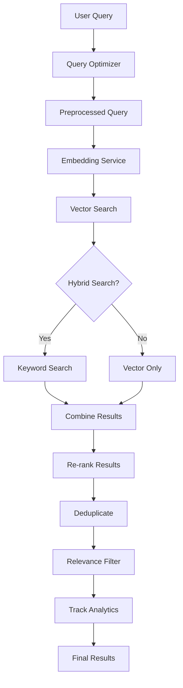

# RAG Query Optimization

This document describes the query optimization features implemented in the RAG (Retrieval-Augmented Generation) pipeline to improve search accuracy, relevance, and user experience.

## Overview

The RAG query optimization system enhances the basic vector search with several advanced techniques:

- **Query Preprocessing**: Normalizes queries, expands acronyms, and removes stop words
- **Hybrid Search**: Combines vector similarity with keyword matching for better recall
- **Result Re-ranking**: Prioritizes results based on source type, recency, and conversation context
- **Deduplication**: Removes similar content to avoid redundant results
- **Relevance Filtering**: Filters out low-confidence results
- **Analytics Tracking**: Monitors query patterns and identifies knowledge gaps
- **Fallback Handling**: Gracefully handles insufficient knowledge scenarios

## Architecture



## Components

### QueryOptimizer

The main optimization engine that handles query preprocessing and result optimization.

**Configuration:**

```typescript
interface QueryOptimizationConfig {
  enablePreprocessing: boolean;
  enableQueryExpansion: boolean;
  enableReranking: boolean;
  enableDeduplication: boolean;
  relevanceThreshold: number;
  maxResults: number;
}
```

**Key Methods:**

- `preprocessQuery()`: Normalizes and expands queries
- `rerankResults()`: Re-ranks based on multiple factors
- `deduplicateResults()`: Removes similar content
- `filterByRelevance()`: Applies relevance threshold
- `hasInsufficientKnowledge()`: Detects knowledge gaps

### Hybrid Search

Combines vector similarity with PostgreSQL full-text search for improved recall.

**Vector Search (70% weight):**

- Uses pgvector cosine similarity
- Semantic understanding of queries
- Good for conceptual matches

**Keyword Search (30% weight):**

- Uses PostgreSQL `ts_rank` and `to_tsvector`
- Exact term matching
- Good for specific terminology

**Combined Score:**

```sql
(vector_similarity * 0.7) + (keyword_score * 0.3) as hybrid_score
```

### Query Analytics

Tracks query patterns to identify popular queries and knowledge gaps.

**Metrics Tracked:**

- Query frequency and patterns
- Average relevance scores
- Low-confidence queries
- User-specific statistics

**Database Schema:**

```sql
CREATE TABLE query_analytics (
  id UUID PRIMARY KEY,
  query TEXT NOT NULL,
  user_id UUID NOT NULL,
  timestamp TIMESTAMP DEFAULT NOW(),
  results_count INTEGER,
  avg_relevance_score FLOAT,
  has_low_confidence BOOLEAN
);
```

## Configuration

### Environment Variables

```bash
# Enable query optimization features
ENABLE_QUERY_OPTIMIZATION=true
ENABLE_HYBRID_SEARCH=true
RELEVANCE_THRESHOLD=0.7
MAX_RESULTS=10

# Source priority weights
SOURCE_PRIORITY_FAQ=1.5
SOURCE_PRIORITY_DOCUMENT=1.0
SOURCE_PRIORITY_CONVERSATION=0.8
```

### RAG Configuration

```typescript
const ragConfig: RAGConfig = {
  topK: 5,
  similarityThreshold: 0.7,
  maxConversationTurns: 5,
  enableQueryOptimization: true,
  enableHybridSearch: true,
  sourcePriority: {
    faq: 1.5, // Highest priority
    document: 1.0, // Standard priority
    conversation: 0.8, // Lower priority
  },
};
```

### Query Optimization Configuration

```typescript
const optimizationConfig: QueryOptimizationConfig = {
  enablePreprocessing: true,
  enableQueryExpansion: true,
  enableReranking: true,
  enableDeduplication: true,
  relevanceThreshold: 0.7,
  maxResults: 10,
};
```

## Usage

### Basic Usage

```typescript
import { RAGOrchestrator } from './services/RAGOrchestrator';
import { QueryOptimizer } from './services/QueryOptimizer';

// Create optimized RAG orchestrator
const ragOrchestrator = RAGOrchestrator.createWithOptimization(
  embeddingService,
  vectorSearchService,
  contextAssembler,
  cacheService,
  ragConfig,
  optimizationConfig,
  process.env.DATABASE_URL
);

// Process query with optimization
const response = await ragOrchestrator.processQuery({
  query: 'How does ML work?',
  userId: 'user-123',
  userProfile: { name: 'John', personalityTraits: ['technical'] },
  conversationHistory: previousTurns,
});

// Check if fallback to general knowledge is needed
if (response.fallbackToGeneral) {
  console.log('Insufficient knowledge, using general LLM knowledge');
}
```

### Analytics Usage

```typescript
// Get popular queries for improvement
const popularQueries = await ragOrchestrator.getPopularQueries('user-123', 10);

// Get low-confidence queries for knowledge base expansion
const lowConfidenceQueries = await ragOrchestrator.getLowConfidenceQueries('user-123', 10);

// Get user query statistics
const stats = await ragOrchestrator.getUserQueryStats('user-123');
console.log(
  `User has made ${stats.totalQueries} queries with ${stats.lowConfidenceRate}% low confidence rate`
);
```

## Query Preprocessing

### Normalization

- Converts to lowercase
- Trims whitespace
- Removes extra spaces
- Standardizes punctuation

### Acronym Expansion

Built-in expansions for common terms:

- AI → artificial intelligence
- ML → machine learning
- API → application programming interface
- FAQ → frequently asked questions
- TTS → text to speech
- ASR → automatic speech recognition

### Stop Word Removal

Removes common English stop words from keyword extraction:

- Articles: a, an, the
- Prepositions: in, on, at, by, for
- Pronouns: it, they, them
- Common verbs: is, are, was, were

### Synonym Expansion

Generates query variations using synonyms:

- create → make, build, generate
- find → search, locate, discover
- help → assist, support, aid

## Re-ranking Factors

### Source Priority

Different content types have different priority weights:

- **FAQs (1.5x)**: Highest priority for direct answers
- **Documents (1.0x)**: Standard priority for detailed information
- **Conversations (0.8x)**: Lower priority for historical context

### Recency Boost

Newer content receives a slight boost:

- Content less than 30 days old: +10% boost
- Content less than 90 days old: +5% boost
- Content older than 1 year: -10% penalty

### Conversation Context

Results matching recent conversation topics receive up to 20% boost based on keyword overlap with the last 3-5 conversation turns.

## Deduplication

### Content Similarity

Uses Jaccard similarity on normalized content:

- Removes punctuation and special characters
- Converts to lowercase
- Filters stop words
- Sorts words alphabetically
- Calculates intersection/union ratio

### Similarity Threshold

Results with >85% similarity are considered duplicates, with only the highest-scoring result retained.

## Fallback Handling

### Insufficient Knowledge Detection

Triggers when:

- No search results found
- Average relevance score below threshold
- All results filtered out by relevance

### Fallback Response

When insufficient knowledge is detected:

- Sets `fallbackToGeneral: true` in response
- LLM service can use general knowledge instead of RAG context
- User receives indication that response is not from their knowledge base

## Performance Considerations

### Caching Strategy

- **L1 Cache**: In-memory query optimization results
- **L2 Cache**: PostgreSQL cached search results
- **L3 Cache**: Cached embeddings for repeated queries

### Database Optimization

- Full-text search indexes on content
- Vector indexes using IVFFlat for pgvector
- Composite indexes on user_id + metadata filters

### Latency Targets

- Query preprocessing: <50ms
- Hybrid search: <200ms
- Re-ranking and deduplication: <100ms
- Total optimization overhead: <350ms

## Monitoring and Analytics

### Key Metrics

- Query processing latency
- Cache hit rates
- Knowledge gap frequency
- User satisfaction scores

### Analytics Queries

```sql
-- Most popular queries
SELECT query, COUNT(*) as frequency
FROM query_analytics
WHERE timestamp > NOW() - INTERVAL '30 days'
GROUP BY query
ORDER BY frequency DESC
LIMIT 10;

-- Knowledge gaps (low confidence queries)
SELECT query, AVG(avg_relevance_score) as avg_score
FROM query_analytics
WHERE has_low_confidence = true
  AND timestamp > NOW() - INTERVAL '7 days'
GROUP BY query
ORDER BY COUNT(*) DESC;

-- User engagement patterns
SELECT
  DATE_TRUNC('day', timestamp) as date,
  COUNT(*) as queries,
  AVG(avg_relevance_score) as avg_relevance
FROM query_analytics
GROUP BY date
ORDER BY date DESC;
```

## Best Practices

### Knowledge Base Optimization

1. **FAQ Priority**: Create FAQs for frequently asked questions
2. **Content Quality**: Ensure documents are well-structured and relevant
3. **Regular Updates**: Keep content fresh to benefit from recency boost
4. **Tag Management**: Use consistent tagging for better filtering

### Query Optimization Tuning

1. **Threshold Adjustment**: Monitor and adjust relevance thresholds based on user feedback
2. **Source Weights**: Tune source priority weights based on content quality
3. **Synonym Management**: Expand synonym mappings for domain-specific terms
4. **Acronym Updates**: Keep acronym expansions current with business terminology

### Performance Optimization

1. **Index Management**: Regularly analyze and optimize database indexes
2. **Cache Tuning**: Monitor cache hit rates and adjust TTL values
3. **Batch Processing**: Use batch operations for analytics and cleanup
4. **Resource Monitoring**: Track CPU and memory usage during peak loads

## Troubleshooting

### Common Issues

**Low Search Quality:**

- Check relevance threshold settings
- Verify source priority weights
- Review synonym and acronym mappings
- Analyze query analytics for patterns

**High Latency:**

- Monitor database query performance
- Check vector index efficiency
- Review cache hit rates
- Optimize hybrid search queries

**Knowledge Gaps:**

- Review low-confidence query analytics
- Identify missing content areas
- Improve document quality and coverage
- Create targeted FAQs

### Debug Logging

Enable detailed logging for troubleshooting:

```typescript
logger.setLevel('debug');
// Logs will include:
// - Query preprocessing steps
// - Search result scores and metadata
// - Re-ranking factor calculations
// - Cache hit/miss information
```

## Related Documentation

- [RAG Pipeline Architecture](./RAG-PIPELINE.md)
- [Vector Database Setup](./VECTOR-DATABASE.md)
- [Caching Architecture](./CACHING-ARCHITECTURE.md)
- [Performance Monitoring](./MONITORING.md)
