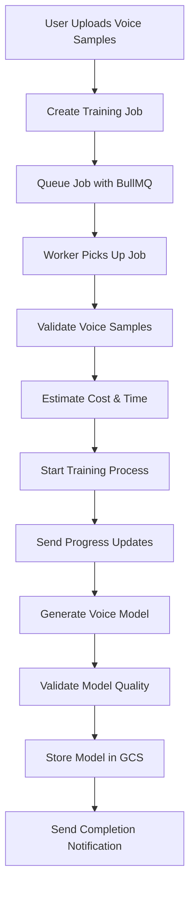

# Voice Model Training Pipeline

## Overview

The Voice Model Training Pipeline enables users to create personalized voice clones using their voice samples. The system supports multiple TTS providers (XTTS-v2, Google Cloud TTS, OpenAI TTS) and provides a complete training workflow with progress tracking, cost estimation, and quality validation.

## Architecture

### Components

1. **TrainingJobQueue** - Manages training job queue using BullMQ
2. **TrainingJobProcessor** - Handles the actual training process
3. **TrainingNotificationService** - Sends notifications during training
4. **Training API Endpoints** - REST API for training management

### Training Flow



## API Endpoints

### Start Training Job

```http
POST /training/start
Content-Type: application/json

{
  "userId": "user-uuid",
  "voiceSampleIds": ["sample-1", "sample-2", "sample-3"],
  "provider": "xtts-v2",
  "priority": 50,
  "options": {
    "epochs": 100,
    "batchSize": 16,
    "learningRate": 0.001,
    "qualityThreshold": 0.8
  }
}
```

**Response:**

```json
{
  "jobId": "job-uuid",
  "message": "Training job created successfully",
  "status": "queued"
}
```

### Get Training Status

```http
GET /training/{jobId}?userId={userId}
```

**Response:**

```json
{
  "id": "job-uuid",
  "userId": "user-uuid",
  "status": "running",
  "progress": 45.5,
  "estimatedCost": 12.5,
  "estimatedTimeMs": 1800000,
  "startedAt": "2024-01-15T10:30:00Z",
  "priority": 50,
  "logs": [
    {
      "timestamp": "2024-01-15T10:30:00Z",
      "level": "info",
      "message": "Training started",
      "metadata": {}
    }
  ]
}
```

### Cancel Training Job

```http
POST /training/{jobId}/cancel
Content-Type: application/json

{
  "userId": "user-uuid"
}
```

### Get User Training Jobs

```http
GET /training/user/{userId}?limit=20&offset=0
```

### Get Queue Statistics

```http
GET /training/stats
```

## Training Providers

### XTTS-v2 (Coqui TTS)

- **Best for:** High-quality voice cloning
- **Training time:** 10-30 minutes
- **Cost:** GPU compute hours (~$2.50/hour)
- **Quality:** Excellent similarity and naturalness
- **Requirements:** 1-5 minutes of clean audio

### Google Cloud TTS Custom Voice

- **Best for:** Production-ready voices
- **Training time:** 2-4 hours
- **Cost:** Fixed training fee (~$300) + usage
- **Quality:** Very good, optimized for clarity
- **Requirements:** 30+ minutes of high-quality audio

### OpenAI TTS Fine-tuning

- **Best for:** Quick prototyping
- **Training time:** 1-2 hours
- **Cost:** Token-based pricing (~$0.008/1K tokens)
- **Quality:** Good, limited customization
- **Requirements:** 5-15 minutes of audio

## Training Options

### Basic Options

```typescript
interface TrainingOptions {
  epochs?: number; // Training epochs (default: 100)
  batchSize?: number; // Batch size (default: 16)
  learningRate?: number; // Learning rate (default: 0.001)
  validationSplit?: number; // Validation split (default: 0.2)
  earlyStoppingPatience?: number; // Early stopping (default: 10)
  qualityThreshold?: number; // Min quality score (default: 0.7)
  maxTrainingTimeMs?: number; // Max training time (default: 2 hours)
}
```

### Advanced Options

```typescript
interface AdvancedOptions {
  modelArchitecture?: string; // Model architecture variant
  augmentationEnabled?: boolean; // Data augmentation
  customLossFunction?: string; // Custom loss function
  regularizationStrength?: number; // L2 regularization
  dropoutRate?: number; // Dropout rate
  optimizerType?: string; // Optimizer (Adam, SGD, etc.)
}
```

## Quality Metrics

### Voice Quality Assessment

```typescript
interface VoiceQualityMetrics {
  similarity: number; // 0-1, voice similarity to original
  naturalness: number; // 0-1, how natural the voice sounds
  clarity: number; // 0-1, audio clarity and intelligibility
  overall: number; // 0-1, overall quality score
}
```

### Quality Thresholds

- **Excellent:** Overall > 0.9
- **Good:** Overall > 0.8
- **Acceptable:** Overall > 0.7
- **Poor:** Overall < 0.7 (training fails)

## Cost Estimation

### XTTS-v2 Costs

```typescript
// GPU compute: $2.50/hour (T4 GPU)
// Storage: $0.02/GB
// Data transfer: $0.09/GB
const estimatedCost = gpuHours * 2.5 + storageGb * 0.02 + transferGb * 0.09;
```

### Google Cloud TTS Costs

```typescript
// Base training: $300
// Additional data: $0.10/minute over 30 minutes
// Storage: $0.02/GB
// API calls: $50
const estimatedCost = 300 + Math.max(0, (durationMinutes - 30) * 0.1) + storageGb * 0.02 + 50;
```

### OpenAI TTS Costs

```typescript
// Training tokens: $0.008/1K tokens
// Storage: $0.02/GB
// API calls: $25
const estimatedCost = (trainingTokens / 1000) * 0.008 + storageGb * 0.02 + 25;
```

## Notifications

### Notification Types

1. **Training Started** - Job begins processing
2. **Progress Updates** - Periodic progress reports (every 10%)
3. **Training Completed** - Successful completion
4. **Training Failed** - Error occurred
5. **Training Cancelled** - User cancelled job

### Notification Channels

- **Push Notifications** - Mobile app notifications
- **Email** - Important status updates
- **WebSocket** - Real-time updates in app
- **Database** - Audit log for history

### Notification Preferences

```typescript
interface NotificationPreferences {
  pushEnabled: boolean; // Push notifications
  emailEnabled: boolean; // Email notifications
  webSocketEnabled: boolean; // Real-time updates
}
```

## Error Handling

### Common Errors

1. **Voice Sample Not Found** - Sample doesn't exist or not accessible
2. **Insufficient Audio Quality** - Audio quality below threshold
3. **Training Timeout** - Training exceeded maximum time
4. **GPU Unavailable** - No GPU resources available
5. **Model Validation Failed** - Generated model quality too low

### Retry Logic

- **Automatic Retries:** 3 attempts with exponential backoff
- **Retry Delays:** 5s, 25s, 125s
- **Retry Conditions:** Temporary failures only
- **Manual Retry:** User can retry failed jobs

### Error Recovery

```typescript
interface ErrorRecovery {
  retryCount: number; // Current retry attempt
  maxRetries: number; // Maximum retries (default: 3)
  lastError: string; // Last error message
  canRetry: boolean; // Whether job can be retried
  suggestedActions: string[]; // Recommended user actions
}
```

## Performance Optimization

### GPU Utilization

- **Concurrent Jobs:** Max 2 per GPU node
- **Queue Priority:** Higher priority jobs processed first
- **Resource Monitoring:** Track GPU memory and utilization
- **Auto-scaling:** Scale GPU nodes based on queue length

### Batch Processing

- **Sample Batching:** Process multiple samples together
- **Model Caching:** Cache frequently used base models
- **Preprocessing:** Parallel audio preprocessing
- **Storage Optimization:** Compress models for storage

### Cost Optimization

- **Preemptible GPUs:** Use spot instances when available
- **Training Scheduling:** Schedule jobs during off-peak hours
- **Model Sharing:** Reuse similar voice models
- **Early Stopping:** Stop training when quality plateaus

## Monitoring and Analytics

### Training Metrics

```typescript
interface TrainingMetrics {
  totalJobs: number; // Total jobs processed
  successRate: number; // Success percentage
  averageTrainingTime: number; // Average training duration
  averageCost: number; // Average cost per job
  averageQuality: number; // Average quality score
  gpuUtilization: number; // GPU utilization percentage
}
```

### Queue Metrics

```typescript
interface QueueMetrics {
  waiting: number; // Jobs waiting in queue
  active: number; // Jobs currently processing
  completed: number; // Completed jobs
  failed: number; // Failed jobs
  delayed: number; // Delayed jobs
}
```

## Security and Privacy

### Data Protection

- **Encryption:** All voice samples encrypted at rest and in transit
- **Access Control:** User-specific data isolation
- **Retention:** Configurable data retention policies
- **Deletion:** Secure deletion of voice samples and models

### Privacy Controls

- **Consent:** Explicit user consent for voice model creation
- **Anonymization:** Remove personal identifiers from training data
- **Audit Trail:** Complete audit log of all operations
- **Data Export:** Users can export their voice models

## Configuration

### Environment Variables

```bash
# Redis Configuration
REDIS_URL=redis://localhost:6379

# Training Configuration
TRAINING_CONCURRENCY=2          # Max concurrent training jobs
TRAINING_TIMEOUT_MS=7200000     # 2 hours max training time
TRAINING_RETRY_ATTEMPTS=3       # Max retry attempts

# GPU Configuration
GPU_NODE_ID=gpu-node-1          # GPU node identifier
GPU_MEMORY_LIMIT=16GB           # GPU memory limit

# Storage Configuration
VOICE_MODELS_BUCKET=digitwin-live-voice-models
VOICE_SAMPLES_BUCKET=digitwin-live-uploads

# Cost Limits
MAX_TRAINING_COST=100.00        # Max cost per training job
DAILY_TRAINING_BUDGET=1000.00   # Daily training budget

# Quality Thresholds
MIN_QUALITY_SCORE=0.7           # Minimum acceptable quality
TARGET_QUALITY_SCORE=0.85       # Target quality score

# Notification Configuration
ENABLE_PUSH_NOTIFICATIONS=true
ENABLE_EMAIL_NOTIFICATIONS=true
ENABLE_WEBSOCKET_NOTIFICATIONS=true
```

## Usage Examples

### Basic Training Job

```typescript
import { TrainingJobQueue } from './services/TrainingJobQueue';

const queue = new TrainingJobQueue(prisma, logger);

// Start training
const jobId = await queue.addTrainingJob({
  userId: 'user-123',
  voiceSampleIds: ['sample-1', 'sample-2'],
  provider: TTSProvider.XTTS_V2,
  priority: 50,
  options: {
    epochs: 100,
    qualityThreshold: 0.8,
  },
});

// Monitor progress
const status = await queue.getTrainingJobStatus(jobId);
console.log(`Training progress: ${status.progress}%`);
```

### Advanced Training Configuration

```typescript
const jobId = await queue.addTrainingJob({
  userId: 'user-123',
  voiceSampleIds: ['sample-1', 'sample-2', 'sample-3'],
  provider: TTSProvider.XTTS_V2,
  priority: 80, // High priority
  options: {
    epochs: 150,
    batchSize: 32,
    learningRate: 0.0005,
    validationSplit: 0.15,
    earlyStoppingPatience: 15,
    qualityThreshold: 0.85,
    maxTrainingTimeMs: 3600000, // 1 hour
    augmentationEnabled: true,
  },
});
```

## Troubleshooting

### Common Issues

1. **Training Stuck in Queue**
   - Check GPU availability
   - Verify Redis connection
   - Check queue worker status

2. **Low Quality Scores**
   - Increase training epochs
   - Use higher quality voice samples
   - Adjust learning rate

3. **Training Timeouts**
   - Reduce training complexity
   - Use fewer voice samples
   - Increase timeout limit

4. **High Costs**
   - Use preemptible GPUs
   - Optimize training parameters
   - Set cost limits

### Debug Commands

```bash
# Check queue status
curl http://localhost:3005/training/stats

# Monitor specific job
curl http://localhost:3005/training/{jobId}?userId={userId}

# Check GPU utilization
nvidia-smi

# View training logs
docker logs tts-service-worker
```

## Related Documentation

- [TTS Service Guide](./TTS-SERVICE-GUIDE.md)
- [Voice Sample Recording](./VOICE-SAMPLE-RECORDING.md)
- [Audio Processing](./AUDIO-PROCESSING.md)
- [GCP Infrastructure](./GCP-INFRASTRUCTURE.md)
- [Caching Architecture](./CACHING-ARCHITECTURE.md)
