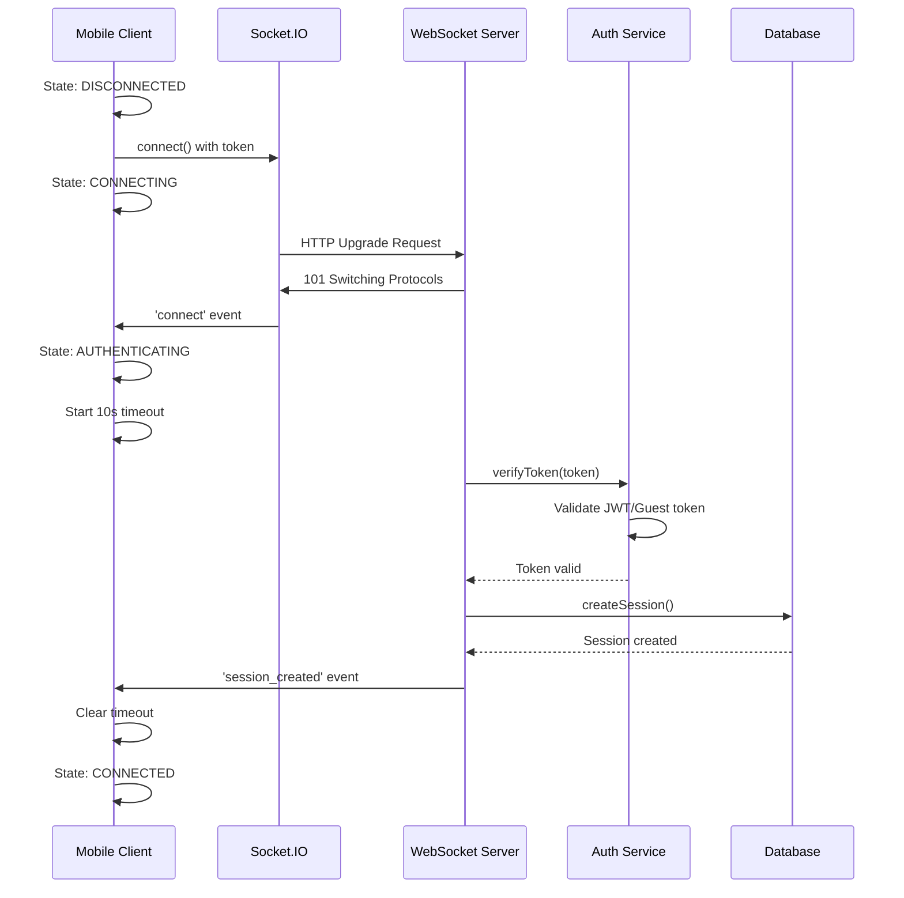
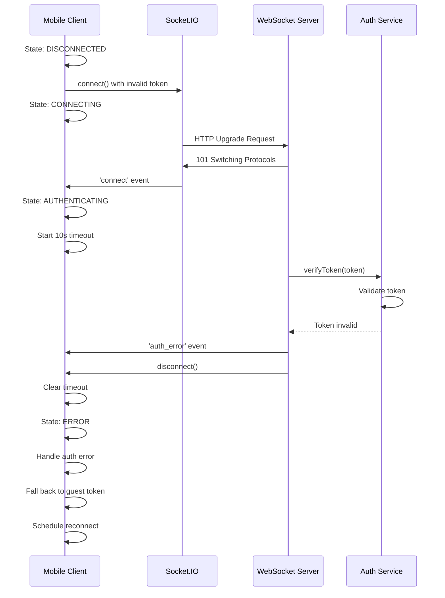
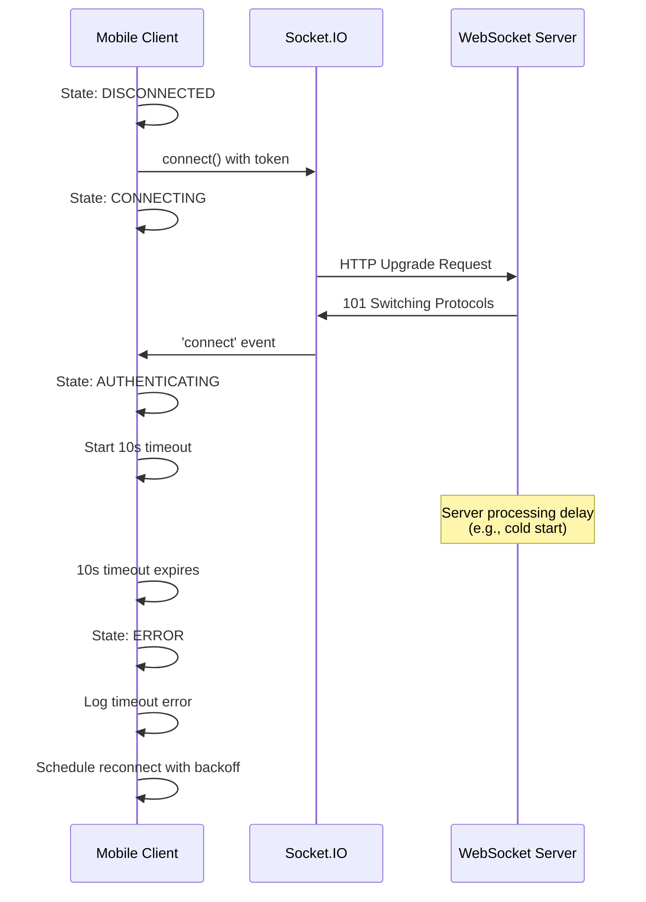
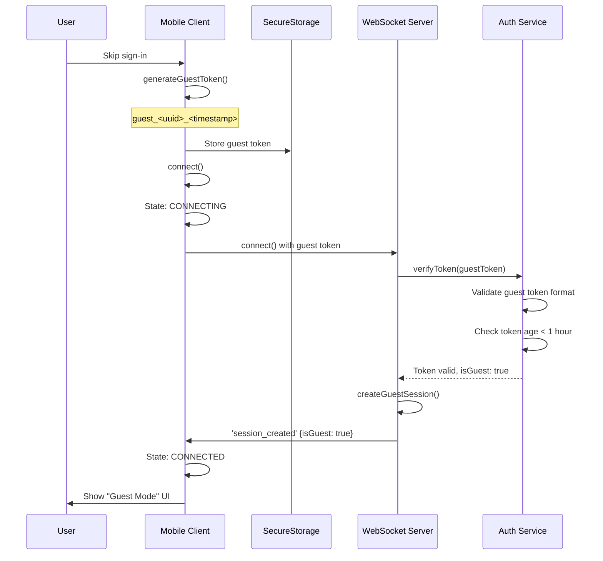
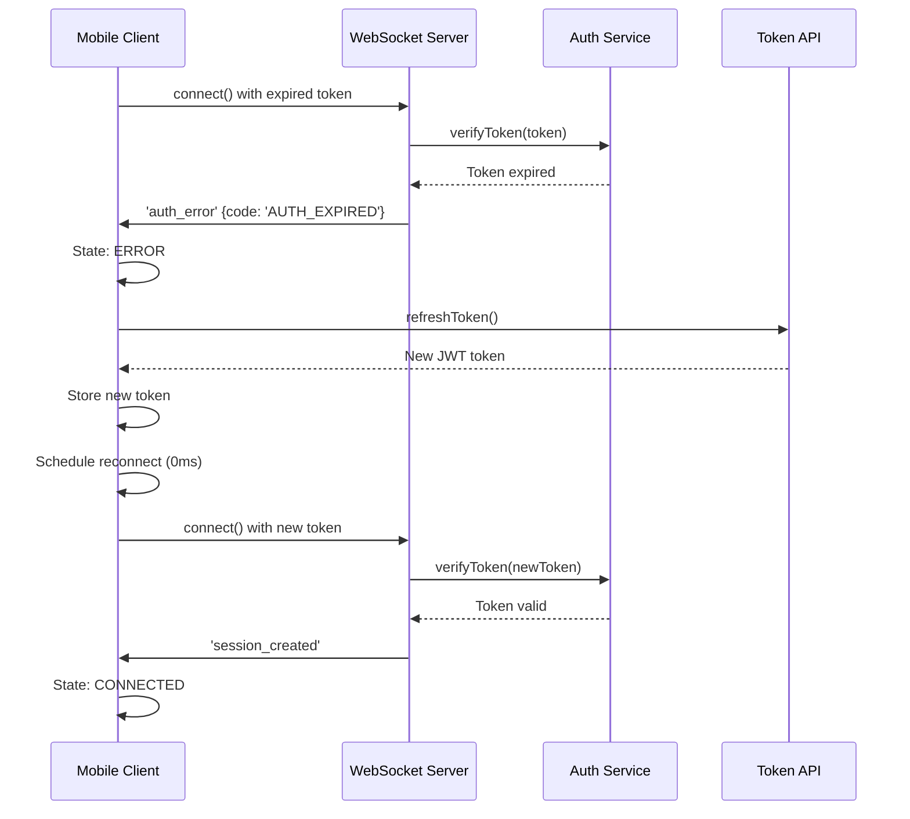
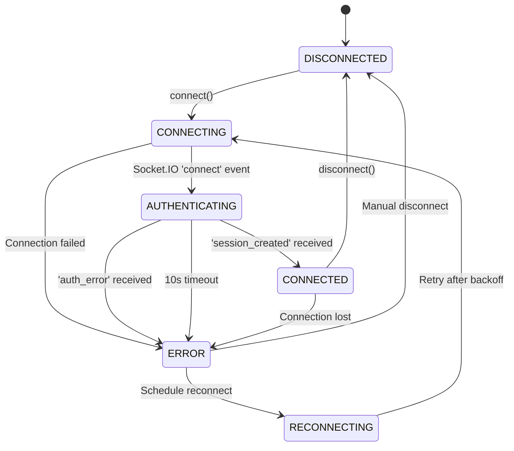
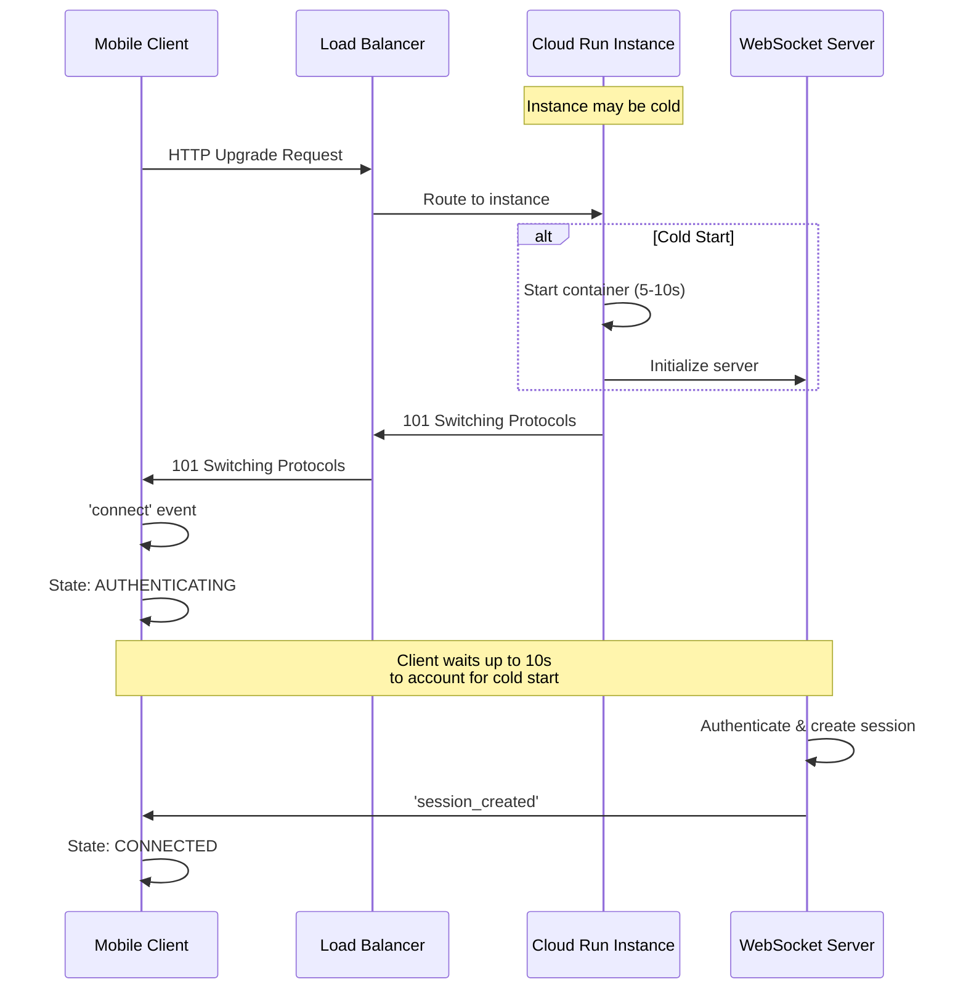
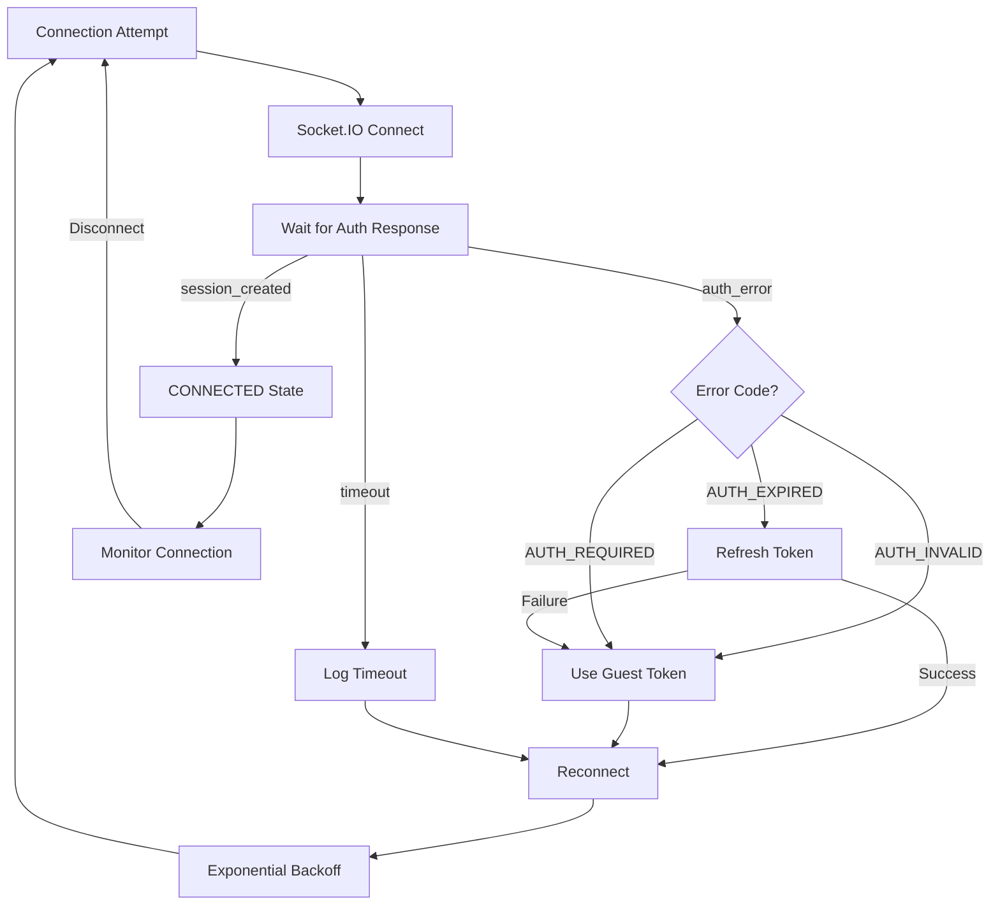
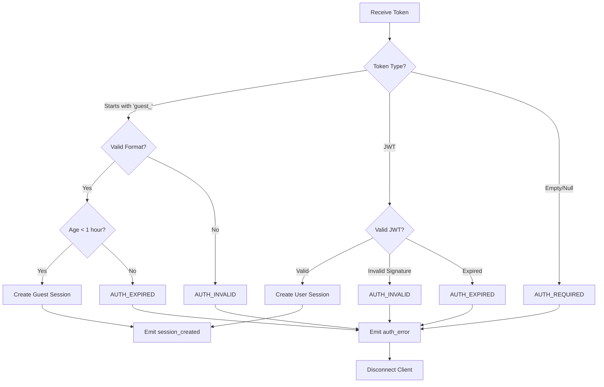

# WebSocket Connection Flow Diagrams

## Successful Connection Flow

## Failed Connection Flow (Invalid Token)

## Timeout Flow

## Guest Token Flow

## Token Refresh Flow

## State Machine Diagram

## Cloud Run Connection Flow

## Error Recovery Flow

## Authentication Decision Tree

## Legend

### States

- **DISCONNECTED**: No active connection
- **CONNECTING**: Socket.IO establishing transport
- **AUTHENTICATING**: Waiting for server authentication response
- **CONNECTED**: Fully connected and authenticated
- **ERROR**: Connection or authentication failed
- **RECONNECTING**: Waiting before retry attempt

### Events

- **connect**: Socket.IO transport established
- **session_created**: Authentication successful, session created
- **auth_error**: Authentication failed
- **disconnect**: Connection closed

### Timeouts

- **Connection Timeout**: 30 seconds (Socket.IO)
- **Authentication Timeout**: 10 seconds (session_created wait)
- **Reconnection Backoff**: Exponential (1s, 2s, 4s, 8s, ...)

### Error Codes

- **AUTH_REQUIRED**: No authentication token provided
- **AUTH_INVALID**: Token format or signature invalid
- **AUTH_EXPIRED**: Token has expired
